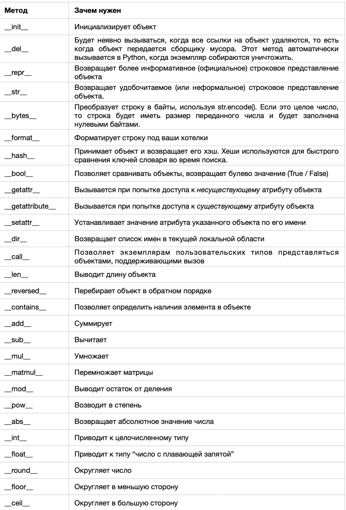

Python и ООП
========================
---
### Какие типы данных вы знаете?

В Python есть несколько стандартных типов данных:

1. Numbers (числа) - int(5), float(5.2), complex (-5i, 3+2i)
2. Strings (строки) - str('текст')
3. Lists (списки) - list [1, 2, 'c']
4. Dictionaries (словари) - dict {'color': 'red', 'model': 'VC6'}
5. Tuples (кортежи) - tuple ('red', 'blue', 'green')
6. Sets (множества) - контейнеры, содержащие уникальные значения. Подразделяются на **изменяемые set** и **неизменяемые frozenset** множества. set {1, 3, 9, 'Ку'}
7. Boolean (логический тип данных) - True False
8. NoneType - None (пустое значение)
9. Байтовые типы – bytes (байты), bytearray (изменяемая байтовая строка), memoryview (предоставление доступа к внутренним данным объекта). bytes(3) = b'\x00\x00\x00'

Эти типы данных можно, в свою очередь, классифицировать по нескольким признакам:

1. изменяемые (mutable) - списки, словари и множества
2. неизменяемые (unmutable) - числа, строки и кортежи, frozenset - все что можно захешировать.
3. упорядоченные (списки, кортежи, строки и словари)
4. неупорядоченные (множества)
    
Подробнее -  [Типы данных в Python](https://proglib.io/p/samouchitel-po-python-dlya-nachinayushchih-chast-3-tipy-dannyh-preobrazovanie-i-bazovye-operacii-2022-10-14)

Чтобы узнать тип данных, нужно воспользоваться встроенной функцией type():

---

### TODO - Что такое хеширование
    5 Глава грокаем алгоритмы 

---

###  Чем кортеж отличается от списка?

---

### Итератор и Генератор.

#### Определение итератора
**Итератор (iterator)** - это объект, который возвращает свои элементы по одному за раз. (например в цикле For).
В Python итератор это любой объект у которого есть метод ```__next__ , __iter__```. 


 ```__iter__``` - Метод возвращает сам итератор.
 
 ```__next__``` - Метод возвращает следующий элемент, если он есть, или возвращает исключение StopIteration.

#### Ограничения итератора
1. Нельзя получить длину итератора функцией len();
2. Итератор не поддерживает получение элемента по индексу;
3. К итератору нельзя применить обычные операции среза или функцию slice()
4. После прохождения по итератору, он остается пустым; (для повторного использования его нужно создать вновь)

Недостаток типа Iterator состоит в том, что при первом его вызове вычисляются сразу все значения последовательности, к тому же все они хранятся в памяти до их исчерпания. Этот недостаток решает тип generator (генератор).

#### Генератор
**Generator*** Генератор - это функция, которая возвращает итератор. Generator не хранит значения последовательности в памяти, а генерирует/вычисляет результат на лету.

Функция считается генератором, если:

1. Cодержит одно или несколько выражений yield.
2. При вызове возвращает объект типа generator, но не начнет выполнение.
3. Методы __iter__() и __next__() реализуются автоматически.
4. После каждого вызова функция приостанавливается, а управление передается вызывающей стороне.
5. Локальные переменные и их состояния запоминаются между последовательными вызовами.
6. Когда вычисления заканчиваются по какому то условию, автоматически вызывается StopIteration.

```Важно! Так как генератор - это "улучшенный" итератор, следовательно на тип generator распространяются такие же ограничения как и тип тип iterator.```

1. generator.send(value): - Метод возобновляет выполнение и “отправляет " значение в функцию генератора. 
2. generator.close(): - Метод вызывает исключение GeneratorExit в точке, где функция генератора была приостановлена.
3. 

Итератор - [Итератор Iterator, протокол итератора в Python](https://docs-python.ru/tutorial/osnovnye-vstroennye-tipy-python/tip-dannyh-iterator-iterator/)

Генератор - [Генератор generator в Python и выражение yield](https://docs-python.ru/tutorial/osnovnye-vstroennye-tipy-python/tip-dannyh-generator-generator/)

[Итераторы в Python для самых маленьких / Хабр](https://habr.com/ru/companies/domclick/articles/674194/)

1. пример кастомного итератора

```
    class TumbochkaIterator:
    def __init__(self, some_objects):
        self.some_objects = some_objects
        self.current = 0

    def __iter__(self):
        return self

    def __next__(self):
        if self.current < len(self.some_objects):
            result = self.some_objects[self.current]
            self.current += 1
            return result
        raise StopIteration
```
2. Перепише цикл For через While
```
try:
    iteraton = iter(object)
    while True:
        print(next(iterator))
except StopIteration:
    pass        
```


---

### Менеджер контекста, зачем он нужен?

Синтаксис оператора контекста with:
```
    with EXPRESSION as TARGET:
        SUITE
        
with open("demo_1.txt", "w") as file:
    file.write("1!")
    
```
Менеджером контекста называется объект, реализующий методы __enter__() и __exit__().  Наиболее часто используется  с открытием файла для чтения или записи, а также создание соединения при работе с базами данных. 

подробнее - [Контекстный менеджер with в Python](https://docs-python.ru/tutorial/osnovnye-vstroennye-tipy-python/kontekstnyj-menedzher-with/#protocol)

[Context manager в рамках языка Python / Хабр](https://habr.com/ru/companies/auriga/articles/724030/)

---
### Dunder method (ака магические)
**Dunder method** - магические методы или методы двойного подчеркивания - это способ, которым создатели классов настраивают экземпляры класса для поддержки определенных режимов поведения, поддерживаемых Python.




подробнее - [Руководство по магическим методам в Питоне / Хабр](https://habr.com/ru/articles/186608/)

[Магические методы Python, о которых вы, возможно, не слышали](https://dev-gang.ru/article/magiczeskie-metody-python-o-kotoryh-vy-vozmozhno-ne-slyshali-woy63ch626/)

---
### Декораторы
Декоратор - это функция, которая позволяет обернуть другую функцию для расширения её функциональности без непосредственного изменения её кода.

```
def outer(func):
    def wrapper(*args, **kwargs):
        print('код до декоратора')
        return func(*args, **kwargs)
    return wrapper
```
Задача: Написать параметризированный декоратор которые делает несколько попыток в случае возникнования ошибки по время выполнения. 

```
def outer(*dargs, **dkwargs):
    def inner(func):
        def wrapper(*args, **kwargs):
            attempts = dkwargs.get("attempts")
            while attempts > 0:
                try:
                    return func(*args, *kwargs)
                except Exception as err:
                    print(f'Error {err}')
                    attempts -= 1
        return wrapper
    return inner

@outer(attempts=5)
def div(a, b):
    return a / b

div(5, 0)
    
или без синт. сахара

div = outer(attempts=5)(div)

```
Декораторы можно применять и на класс, будет выполнятся при создании экземпляпа класса.

#### иерархия выполнения декораторов (несколько @  у функции). 

Сначала интерпретатор высматривает все декораторы, которые принимают какие-либо параметры, такие декораторы в приоритете выполнения и они будут выполняться сверху вниз по очереди.
После того как все декораторы с параметрами в порядке очереди были выполнены далее идут декораторы без параметров (также сверху вниз один за другим).

YT ролики - [РАЗБИРАЕМСЯ С ДЕКОРАТОРАМИ В PYTHON С НУЛЯ (ЧАСТЬ 1) - YouTube](https://www.youtube.com/watch?v=GhgmInoT54c&list=PLlKID9PnOE5h8VJyEiEd_Uv_-tt9KX7MD&index=1)

---

### Что такое интерпретируемый язык? Что такое интерпретатор и как он работает в Python?

Интерпретатор - это программа, которая конвертирует ваши инструкции, написанные на Python, в байт-код и выполняет их. По сути интерпретатор — это программный слой между вашим исходным кодом и железом.

Существует 2 типа интерпретаторов:

1. Простой интерпретатор. Он берет одну инструкцию, транслирует и сразу выполняет ее, а затем берет следующую инструкцию.
2. Интерпретатор компилирующего типа. Это система из компилятора и интерпретатора. Компилятор переводит исходный код программы в промежуточное представление (байт-код), а интерпретатор (виртуальная машина) выполняет этот байт-код.

Интерпретатор транслирует (переводит) исходные инструкции вашей программы в байт-код (низкоуровневое, платформонезависимое представление исходного текста). Такая трансляция необходима в первую очередь для повышения скорости. 
Если Python-интерпретатор обладает правом записи, он будет сохранять байт-код в виде файла с расширением *.pyc . Если исходный текст программы не изменился с момента последней компиляции, при следующем запуске вашей программы, Python сразу загрузит файл .pyc, минуя этап компиляции.

Как только байт-код скомпилирован, он отправляется на виртуальную машину Python (PVM). Здесь выполняется байт-код на PVM. Если во время этого выполнения возникает ошибка, то выполнение останавливается с сообщением об ошибке. PVM является частью Python-интерпретатора. По сути это просто большой цикл, который выполняет перебор инструкций в байт-коде и выполняет соответствующие им операции.

#### CPython и альтернативы

**CPython**
  - Интерпретатор компилирующего типа (благодаря этому достигается большее быстродействие выполнения программ).
  - Считается эталонной реализацией языка Python.
  - Написан на C.
  - Исходный код CPython находится в открытом доступе.
  - Его разработка ведётся группой разработчиков под руководством Гвидо ван Россума — создателя Python.

**Jython**.

Основная цель данный реализации — тесная интеграция с языком Java. Работает следующим образом:
  - Java-классы выполняют компиляцию программного кода на языке Python в байт-код Java.
Полученный байт-код запускается на виртуальной машине Java (JVM).
  - Jython позволить Python-программам управлять Java-приложениями. Во время выполнения такая программа ведет себя точно так же, как настоящая программа на языке Java.

**IronPython**

Предназначена для обеспечения интеграции Python-программ с C# приложениями на Microsoft .NET Framework или Mono. Принцип работы такой же, как и у Jython.

**PyPy**

PyPy — это интерпретатор Python, написанный на Python (если быть точнее, то на RPython).
Особенностью PyPy является использование трассирующего JIT-компилятора (just-in-time), который на лету транслирует некоторые элементы в машинный код. Благодаря этому, при выполнении некоторых операций PyPy обгоняет CPython в несколько раз. Но плата за такую производительность — более высокое потребление памяти.


подробнее - [Как работает Python — интерпретатор, байт-код, PVM](https://pythonchik.ru/osnovy/kak-rabotaet-python-interpretator)

---

###  Что такое статическая и динамическая типизация и в чем это проявляется в Python?

###  В каких случаях лучше использовать кортеж, а в каких - список?
###  Как вы объясните человеку, что такое множество?
###  Что такое словари и как они работают?
###  Как работают типы данных хэшмап, связанный список, двусвязный список, массив?
###  Что такое О (о-большое)? Зачем и как используется?
###  Какая сложность вставки, извлечения, поиска элементов в словаре и списке?
###  Что такое функции и зачем они нужны?
###  Какие бывают аргументы у функций?
###  Что такое распаковка коллекций?
###  Что такое исключения? Какие они бывают? Как их использовать?
###  Что такое ООП? На каких концепциях стоит ООП?
###  Объяснить понятие класса и объекта (экземпляра).
###  Что такое инкапсуляция? Накодить пример.
###  Что такое наследование? Накодить пример.
###  Бывает ли в Python множественное наследование? Как ты относишься к этому факту?
###  Если у нескольких классов-родителей есть методы с одинаковыми названиями, то какой из них будет вызван в наследнике?
###  Что такое полиморфизм? Накодить пример.
###  Что такое staticmethod? 
###  Чем staticmethod отличается от простой функции? 
###  Когда будем использовать staticmethod, а когда простую функцию?
###  Что такое classmethod? В чём его особенности? Когда применяется?
###  Что такое магические методы и за что они отвечают?
###  Что такое конструктор объектов в Python и из чего он состоит и как работает?
###  Почему в методе __init__ есть аргумент self?
###  Что такое приватные и защищенные атрибуты? Как они работают?
### Можно ли получить доступ к приватным атрибутам в Python?
###  Какие способы конкурентного выполнения программ в Python бывают?
###  Что такое GIL и как он работает?
###  В каких случаях GIL не работает?
###  Что такое сборщик мусора и как он работает?
###  Что такое потоки и процессы? Чем отличается поток от процесса?
###  Что такое системный вызов fork?
###  Какие существуют способы синхронизации процессов и потоков?
###  Как передавать информацию из одного процесса в другой?
###  Что такое эффект гонок? Как с ним бороться?
###  Что такое асинхронность?
###  Что такое event loop и как он работает?
###  Сколько потоков и процессов работает во время асинхронного выполнения кода?
###  Для каких задач стоит использовать потоки, для каких - процессы, а для каких - асинхронность?


    
    

