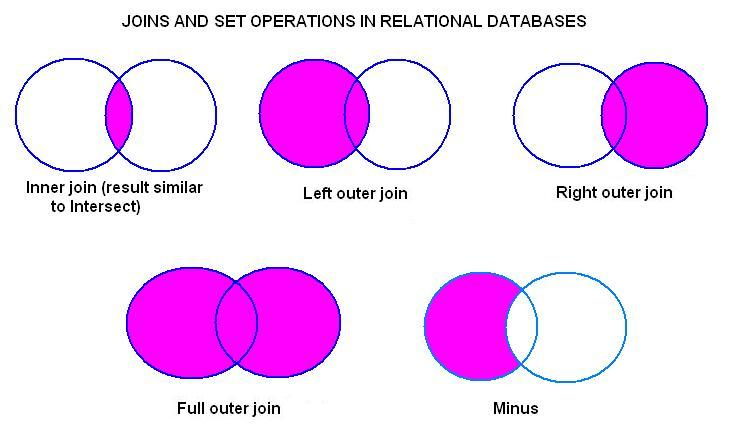

SQL Запросы
========================
## Синтаксис и его стандарты

1. стоит изучить руководство по стилю SQL [Руководство по стилю SQL · SQL style guide by Simon Holywell](https://www.sqlstyle.guide/ru/)
2. можете отформатировать ваш запрос с помощью, например, https://codebeautify.org/sqlformatter
3. [Format SQL Statements Online - sqlformat.org](https://sqlformat.org/)

Ниже решены задачи из этого курса - [Интерактивный тренажер по SQL — Stepik](https://stepik.org/course/63054/syllabus)

---
## Типы данных в SQLite
ss
Не во всех базах данных поддерживается полный набор типов данных. Например, SQLite поддерживает только пять из них: 
1. INTEGER — целое число;
2. REAL — дробное число;
3. TEXT — текст;
4. BLOB — двоичные данные;
5. NULL — специальное значение, означающее отсутствие информации.

Поэтому при работе с SQLite приходится идти на всякие хитрости:
логические True и False хранятся в поле типа INTEGER в виде значений 0 и 1, но при получении информации проверка на истинность проводится с помощью идентификаторов TRUE или FALSE; при работе со временем и датой значения в базе данных сохраняют в виде строк или чисел.

---
## Cоздание таблицы.

```SQL
    CREATE TABLE book(
    book_id INT PRIMARY KEY AUTO_INCREMENT,
    title VARCHAR(50),
    author VARCHAR(30),
    price DECIMAL(8, 2),
    amount INT
    );

или 

    CREATE TABLE IF NOT EXISTS movies(
    id INTEGER PRIMARY KEY,
    name TEXT NOT NULL,
    original_name_id INTEGER NOT NULL UNIQUE,
    FOREIGN KEY(original_name_id) REFERENCES original_names(id)
    );        
```
Новая таблица может быть создана на основе данных из другой таблицы. Для этого используется запрос SELECT, результирующая таблица которого и будет новой таблицей базы данных. При этом имена столбцов запроса становятся именами столбцов новой таблицы. 

Пример. Создать таблицу заказ (ordering), куда включить авторов и названия тех книг, количество экземпляров которых в таблице book меньше 4. Для всех книг указать одинаковое количество экземпляров 5.
```SQL
CREATE TABLE ordering AS
SELECT author, title, 5 AS amount
FROM book
WHERE amount < 4;
```
Пример. Создать таблицу заказ (ordering), куда включить авторов и названия тех книг, количество экземпляров которых в таблице book меньше 4. Для всех книг указать одинаковое значение - среднее количество экземпляров книг в таблице book.
```SQL
CREATE TABLE ordering AS
SELECT author, title, 
   (
    SELECT ROUND(AVG(amount)) 
    FROM book
   ) AS amount
FROM book
WHERE amount < 4;
```
Пример 3. Создать таблицу заказ (ordering), куда включить авторов и названия тех книг, количество экземпляров которых в таблице book меньше среднего количества экземпляров книг в таблице book. В таблицу включить столбец   amount, в котором для всех книг указать одинаковое значение - среднее количество экземпляров книг в таблице book.
```SQL
CREATE TABLE ordering AS 
    SELECT author, title, (SELECT ROUND(AVG(amount)) FROM book) AS amount
    FROM book
    WHERE amount<(SELECT ROUND(AVG(amount)) FROM book);
```

```

```
```

```
---
## Вставка записи в таблицу

```SQL
 INSERT INTO book (title, author, price, amount)
 VALUES
    ('Белая гвардия', 'Булгаков М.А.', 540.50 , 5),
    ('Идиот', 'Достоевский Ф.М.', 460, 10),
    ('Братья Карамазовы', 'Достоевский Ф.М.', 799.01, 2);   
```
## Выборка данных из таблицы

```SQL
    SELECT title  AS Название, 
           author AS Автор
    FROM book;

SELECT title, author, amount, ROUND(price*0.7,2) AS new_price
FROM book
```
### SQL IF

IF(логическое_выражение, True = выражение_1, False = выражение_2)

Функция вычисляет логическое_выражение, если оно истина – в поле заносится значение выражения_1, в противном случае –  значение выражения_2. Все три параметра IF() являются обязательными.

Допускается использование вложенных функций, вместо выражения_1 или выражения_2 может стоять новая функция IF.

Пример 1. Для каждой книги из таблицы book установим скидку следующим образом: если количество книг меньше 4, то скидка будет составлять 50% от цены, в противном случае 30%.

```SQL
    SELECT title, amount, price, 
        IF(amount<4, price*0.5, price*0.7) AS sale
    FROM book;

```
Пример 2.  Усложним вычисление скидки в зависимости от количества книг. Если количество книг меньше 4 – то скидка 50%, меньше 11 – 30%, в остальных случаях – 10%. И еще укажем какая именно скидка на каждую книгу.
 
```SQL
SELECT title, amount, price, ROUND(
   IF(amount < 4, price * 0.5, IF(amount < 11, price * 0.7, price * 0.9)), 2) AS sale,
   IF(amount < 4, 'скидка 50%', IF(amount < 11, 'скидка 30%', 'скидка 10%')) AS Ваша_скидка

FROM book;    
```
Пример 3. Решили поднять цену книг Булгакова на 10%, а цену книг Есенина - на 5%. Написать запрос, куда включить автора, название книги и новую цену, последний столбец назвать new_price. Значение округлить до двух знаков после запятой.
```SQL
SELECT author, 
       title, 
       round (if(author = 'Булгаков М.А.', price*1.1, 
              if (author = 'Есенин С.А.', price*1.05, price)
       ),2) AS new_price
FROM book
```

---
###  Логические операции
 
 Логическое выражение после ключевого слова WHERE кроме операторов сравнения  и выражений может включать  логические операции (И «and», ИЛИ «or», НЕ «not») и круглые скобки, изменяющие приоритеты выполнения операций.

Приоритеты операций:

1. круглые скобки
2. умножение  (*),  деление (/)
3. сложение  (+), вычитание (-)
4. операторы сравнения (=, >, <, >=, <=, <>)
5. NOT
6. AND
7. OR

Вывести название, автора,  цену  и количество всех книг, цена которых меньше 500 или больше 600, а стоимость всех экземпляров этих книг больше или равна 5000.
```SQL
SELECT title, author, price, amount
FROM book 
WHERE (price < 500 OR price > 600) AND price*amount > 5000
```
---
###  операторы BETWEEN, IN

```SQL
SELECT title, author
FROM book
WHERE (price BETWEEN 540.50 AND 800) AND amount IN (2, 3, 5, 7)
```
---
###  Выборка данных с сортировкой

При выборке можно указывать столбец или несколько столбцов, по которым необходимо отсортировать отобранные строки. Для этого используются ключевые слова ORDER BY, после которых задаются имена столбцов. При этом строки сортируются по первому столбцу, если указан второй столбец, сортировка осуществляется только для тех строк, у которых значения первого столбца одинаковы. По умолчанию ORDER BY выполняет сортировку по возрастанию. Чтобы управлять направлением сортировки вручную, после имени столбца указывается ключевое слово ASC (по возрастанию) или DESC (по убыванию). 

Столбцы после ключевого слова ORDER BY можно задавать:
- названием столбца;
- номером столбца;
- именем столбца (указанным после AS).

Пример. Вывести  автора и название  книг, количество которых принадлежит интервалу от 2 до 14 (включая границы). Информацию  отсортировать сначала по авторам (в обратном алфавитном порядке), а затем по названиям книг (по алфавиту).

```SQL
SELECT author, title
FROM book
WHERE amount BETWEEN 2 and 14
ORDER BY author DESC, title
```

---
### Выборка данных, оператор LIKE
Оператор LIKE используется для сравнения строк. В отличие от операторов отношения равно (=) и не равно (<>), LIKE позволяет сравнивать строки не на полное совпадение (не совпадение), а в соответствии с шаблоном. Шаблон может включать обычные символы и символы-шаблоны. При сравнении с шаблоном, его обычные символы должны в точности совпадать с символами, указанными в строке. Символы-шаблоны могут совпадать с произвольными элементами символьной строки.
```SQL
SELECT * 
FROM book 
WHERE author LIKE '%М.%'
```
выполняет поиск и выдает все книги, инициалы авторов которых содержат «М.»
```SQL
SELECT * 
FROM book 
WHERE title LIKE 'Поэм_'
```
выполняет поиск и выдает все книги, названия которых либо «Поэма», либо «Поэмы» и пр.

```
Вывести книги, название которых длиннее 5 символов:
```
SELECT title FROM book WHERE title LIKE "_____"
```
```
Вывести названия книг, которые состоят ровно из одного слова, если считать, что слова в названии отделяются друг от друга пробелами .
```SQL
SELECT title 
FROM book 
WHERE title NOT LIKE "% %";   

```
Задание. Вывести название и автора тех книг, название которых состоит из двух и более слов, а инициалы автора содержат букву «С». Считать, что в названии слова отделяются друг от друга пробелами и не содержат знаков препинания, между фамилией автора и инициалами обязателен пробел, инициалы записываются без пробела в формате: буква, точка, буква, точка. Информацию отсортировать по названию книги в алфавитном порядке.

```SQL
SELECT title, author
FROM book
WHERE author LIKE '_%С.%' AND title LIKE '_% _%'
ORDER BY title
```
### Оператор LIMIT

Для ограничения вывода записей в SQL используется оператор LIMIT. Результирующая таблица будет иметь количество строк не более указанного после LIMIT. LIMIT размещается после раздела ORDER BY.

Пример. Вывести информацию о первой  командировке из таблицы trip. "Первой" считать командировку с самой ранней датой начала.
```SQL
SELECT *
FROM trip
ORDER BY  date_first
LIMIT 1;
```
- Важно. Оператор LIMIT нужно использовать очень осторожно. Например, если бы в таблице trip было несколько командировок с одинаковой датой начала, этот запрос работал бы НЕВЕРНО. Это связано с тем, что заранее  известно точное значение таких командировок.

Пример. Вывести два города, в которых чаще всего были в командировках сотрудники. Вычисляемый столбец назвать Количество.
```SQL
SELECT city, COUNT(city) AS Количество
FROM trip
GROUP BY city
ORDER BY Количество DESC
LIMIT 2
```

```

```

---

## Запросы, групповые операции

Чтобы отобрать уникальные элементы некоторого столбца используется ключевое слово DISTINCT, которое размещается сразу после SELECT.
```SQL
SELECT DISTINCT author 
FROM book;
```
GROUP BY, который группирует данные при выборке, имеющие одинаковые значения в некотором столбце. Столбец, по которому осуществляется группировка, указывается после GROUP BY . С помощью GROUP BY можно выбрать уникальные элементы столбца, по которому осуществляется группировка. Результат будет точно такой же как при использовании DISTINCT.
```SQL
SELECT author 
FROM book 
GROUP BY author;
```
---
### функции SUM и COUNT

Если столбец указан в SELECT  **БЕЗ применения** групповой функции, то он обязательно должен быть указан и в GROUP BY.Иначе получим ошибку.

```SQL
SELECT author, SUM(amount)
FROM book
GROUP BY author;
```
Задание. Посчитать, количество различных книг и количество экземпляров книг каждого автора , хранящихся на складе.  Столбцы назвать Автор, Различных_книг и Количество_экземпляров соответственно.

```
SELECT author AS 'Автор', count(title) AS 'Различных_книг', sum(amount) AS 'Количество_экземпляров'
FROM book
GROUP BY author
```
---
### функции MIN, MAX и AVG
и другая арифметимка выборок
```SQL
SELECT author, MIN(price) AS 'Минимальная_цена', MAX(price) AS 'Максимальная_цена', AVG(price) AS 'Средняя_цена'
FROM book
GROUP BY author

или 

SELECT author, SUM(price * amount) AS 'Стоимость', ROUND(SUM(price * amount)/ 1.18 * 0.18,2) AS 'НДС' , ROUND(SUM(price * amount) - (SUM(price * amount) / 1.18 * 0.18),2) AS 'Стоимость_без_НДС' 
FROM book
GROUP BY author
```
Групповые функции позволяют вычислять итоговые значения по всей таблице. Например, можно посчитать общее количество книг на складе, вычислить суммарную стоимость и пр. Для этого после ключевого слова SELECT указывается групповая функция для выражения или имени столбца, а ключевые слова GROUP BY опускаются.

```SQL
SELECT ROUND(MIN(price),2) AS 'Минимальная_цена', ROUND(MAX(price),2) AS 'Максимальная_цена', ROUND(AVG(price),2) AS 'Средняя_цена'
FROM book

```
---
###  Выборка данных по условию
В запросы с групповыми функциями можно включать условие отбора строк, которое в обычных запросах записывается после WHERE. В запросах с групповыми функциями вместо WHERE используется ключевое слово HAVING , которое размещается после оператора GROUP BY.

Пример. Найти минимальную и максимальную цену книг всех авторов, общая стоимость книг которых больше 5000. Результат вывести по убыванию минимальной цены.
```SQL
SELECT author,
    MIN(price) AS Минимальная_цена, 
    MAX(price) AS Максимальная_цена
FROM book
GROUP BY author
HAVING SUM(price * amount) > 5000 
ORDER BY Минимальная_цена DESC;
```
Пример 2. Вычислить среднюю цену и суммарную стоимость тех книг, количество экземпляров которых принадлежит интервалу от 5 до 14, включительно. Столбцы назвать Средняя_цена и Стоимость, значения округлить до 2-х знаков после запятой.
```SQL
SELECT ROUND(AVG(price),2) AS 'Средняя_цена', ROUND(SUM(price * amount),2) AS 'Стоимость'
FROM book
WHERE amount BETWEEN 5 AND 14
```
Пример 3. Вывести максимальную и минимальную цену книг каждого автора, кроме Есенина, количество экземпляров книг которого больше 10
```
SELECT author,
    MIN(price) AS Минимальная_цена,
    MAX(price) AS Максимальная_цена
FROM book
WHERE author <> 'Есенин С.А.'
GROUP BY author
HAVING SUM(amount) > 10;
```
Пример 4. Посчитать стоимость всех экземпляров каждого автора без учета книг «Идиот» и «Белая гвардия». В результат включить только тех авторов, у которых суммарная стоимость книг (без учета книг «Идиот» и «Белая гвардия») более 5000 руб. Вычисляемый столбец назвать Стоимость. Результат отсортировать по убыванию стоимости.

```SQL
SELECT author,sum(price*amount) as Стоимость 
FROM book
WHERE title != "Идиот" and title != "Белая гвардия"  
GROUP BY author
HAVING sum(price*amount)>5000
ORDER BY Стоимость DESC;
```
---
## Последовательность операций на сервере:
MySQL: FROM => WHERE = SELECT = GROUP BY = HAVING = ORDER BY = LIMIT.   

PostgreSQL: FROM => WHERE = GROUP BY = HAVING = SELECT = DISTINCT = ORDER BY = LIMIT.

Поэтому мы смогли использовать Стоимость и в HAVING и в ORDER BY . В PostgreSQL мы такое не сможем провернуть в HAVING .

---
## Спискок самых важных операторов и ключевых слов в SELECT
```SQL
    SELECT('столбцы (* - для выбора всех столбцов); обязательно')
    (могут применяться агрегатные функции COUNT, MIN, MAX, AVG и SUM; необязательно)
    (и ключевое слово DISTINCT; необязательно)
    FROM('таблица; обязательно')
    WHERE('условие/фильтрация; необязательно')
    GROUPBY('столбец, по которому нужно сгруппировать данные; необязательно')
    HAVING('условие/фильтрация на уровне сгруппированных данных; необязательно')
    ORDERBY('столбец, по которому нужно ранжировать вывод; необязательно')
    LIMIT ('сколько записей показывать; необязательно')
    OFFSET('начиная с какой записи показывать; необязательно')
```
---
## Вложенные запросы

Вложенный запрос (подзапрос, внутренний запрос) – это запрос внутри другого запроса SQL. 

Пример. Вывести информацию (автора, название и цену) о  книгах, цены которых меньше или равны средней цене книг на складе. Информацию вывести в отсортированном по убыванию цены виде. Среднее вычислить как среднее по цене книги.

```SQL
SELECT author, title, price
FROM book
WHERE price < (SELECT AVG(price) FROM book)
ORDER BY price DESC

```
Пример. Вывести информацию (автора, название и цену) о тех книгах, цены которых превышают минимальную цену книги на складе не более чем на 150 рублей в отсортированном по возрастанию цены виде.
```SQL
SELECT author, title, price
FROM book
WHERE price - (SELECT MIN(price) FROM book) <= 150
ORDER BY price
```
###  оператор IN

WHERE имя_столбца IN (вложенный запрос, возвращающий один столбец)

Пример. Вывести информацию о книгах тех авторов, общее количество экземпляров книг которых не менее 12.
```
SELECT title, author, amount, price
FROM book
WHERE author IN (
        SELECT author 
        FROM book 
        GROUP BY author 
        HAVING SUM(amount) >= 12
      );
```
Вывести информацию (автора, книгу и количество) о тех книгах, количество экземпляров которых в таблице book не дублируется.
```SQL
SELECT author, title, amount 
FROM book
WHERE amount IN (
                 SELECT amount
                 FROM book 
                 GROUP BY amount
                 HAVING COUNT(amount) = 1
                );
```
### операторы ANY и ALL
Операторы ALL и ANY можно использовать только с вложенными запросами.

столбец < ANY (10, 15, 20, 30)

мы как бы говорим "ну если значение столбца меньше хоть какого-то значения в списке, то это нам подходит". Соответственно, если значение меньше самого большого значения списка (30), то по другим значениям можно и не проверять. Но если значение столбца не меньше (больше) самого большого значения в списке, значит оно будет больше и всех остальных и нам не подходит.

столбец < ALL (10, 15, 20, 30)

мы как бы говорим "значение столбца должно быть меньше всех значений в списке". Соответственно, если значение столбца меньше наименьшего значения в списке (10), то оно нам подходит. С другой стороны, если значение столбца больше наименьшего значения в списке, то уже выражение "меньше всех значений в списке" не истинно, и значение столбца нам не подходит.


Вывести информацию о тех книгах, количество которых меньше самого маленького среднего количества книг каждого автора.
```SQL
SELECT title, author, amount, price
FROM book
WHERE amount < ALL (
        SELECT AVG(amount) 
        FROM book 
        GROUP BY author 
      );
```
Вывести информацию о книгах(автор, название, цена), цена которых меньше самой большой из минимальных цен, вычисленных для каждого автора.
```SQL
SELECT author, title, price
FROM book
WHERE price < ANY (SELECT MIN(price)
                   FROM book
                   GROUP BY author);
```
### Вложенный запрос после SELECT

Посчитать сколько и каких экземпляров книг нужно заказать поставщикам, чтобы на складе стало одинаковое количество экземпляров каждой книги, равное значению самого большего количества экземпляров одной книги на складе. Вывести название книги, ее автора, текущее количество экземпляров на складе и количество заказываемых экземпляров книг. Последнему столбцу присвоить имя Заказ. В результат не включать книги, которые заказывать не нужно.
```
SELECT title, author, amount, (SELECT MAX(amount) FROM book)- amount AS Заказ
FROM book
WHERE (SELECT MAX(amount) FROM book) > amount;
```
## запросы Корректировки данных

```SQL
INSERT INTO supply(supply_id, title, author, price, amount)
VALUES 
    ('1', 'Лирика', 'Пастернак Б.Л.', '518.99', '2'),
    ('2', 'Черный человек', 'Есенин С.А.', '570.20', '6'),
    ('3', 'Белая гвардия', 'Булгаков М.А.', '540.50', '7'),
    ('4', 'Идиот', 'Достоевский Ф.М.', '360.80', '3')
```

---
###  Добавление записей из другой таблицы
Правила соответствия между полями таблицы и вставляемыми значениями из запроса:

1. количество полей в таблице и количество полей в запросе должны совпадать;
2. должно существовать прямое соответствие между позицией одного и того же элемента в обоих списках, 
поэтому первый столбец запроса должен относиться к первому столбцу в списке столбцов таблицы, второй – ко второму столбцу и т.д.
3. типы столбцов запроса должны быть совместимы с типами данных соответствующих столбцов таблицы ( целое число можно занести в поле типа DECIMAL, обратная операция – недопустима).

Пример. Добавить из таблицы supply в таблицу book, все книги, кроме книг, написанных Булгаковым М.А. и Достоевским Ф.М.
```SQL
INSERT INTO book (title, author, price, amount)
SELECT title, author, price, amount
FROM supply
WHERE author NOT IN ('Булгаков М.А.', 'Достоевский Ф.М.')
```
Пример 2. Занести из таблицы supply в таблицу book только те книги, авторов которых нет в  book.
```SQL
INSERT INTO book (title, author, price, amount)
SELECT title, author, price, amount
FROM supply
WHERE author NOT IN (SELECT author FROM book)
```
---
### Запросы на обновление

UPDATE таблица SET поле = выражение

Пример. Уменьшить на 30% цену тех книг в таблице book, количество которых меньше 5.
```SQL
UPDATE book 
SET price = 0.7 * price 
WHERE amount < 5;
```
Пример. Уменьшить на 10% цену тех книг в таблице book, количество которых принадлежит интервалу от 5 до 10, включая границы.

```SQL
UPDATE book
SET price = price * 0.9
WHERE amount BETWEEN 5 AND 10;
```
Пример. В столбце buy покупатель указывает количество книг, которые он хочет приобрести. Для каждой книги, выбранной покупателем, необходимо уменьшить ее количество на складе на указанное в столбцеbuy количество, а в столбец buy занести 0.

```SQL
UPDATE book 
SET amount = amount - buy,
    buy = 0;
```
Пример. В таблице book необходимо скорректировать значение для покупателя в столбце buy таким образом, чтобы оно не превышало количество экземпляров книг, указанных в столбце amount. А цену тех книг, которые покупатель не заказывал, снизить на 10%.
```SQL
UPDATE book
SET price = IF(buy <= 0, price * 0.9, price),
    buy = IF(amount <= buy, amount, buy);
```
**В запросах на обновление можно использовать несколько таблиц, но тогда:**

1. для столбцов, имеющих одинаковые имена, необходимо указывать имя таблицы, к которой они относятся, например: book.price – столбец price из таблицы book, supply.price – столбец price из таблицы supply;
2. все таблицы, используемые в запросе, нужно перечислить после ключевого слова UPDATE;
3. в запросе обязательно условие WHERE, в котором указывается условие при котором обновляются данные.

Пример. Если в таблице supply  есть те же книги, что и в таблице book, добавлять эти книги в таблицу book не имеет смысла. Необходимо увеличить их количество на значение столбца amount таблицы supply.
```SQL
UPDATE book, supply 
SET book.amount = book.amount + supply.amount
WHERE book.title = supply.title AND book.author = supply.author;
```
Пример 2. Для тех книг в таблице book , которые есть в таблице supply, не только увеличить их количество в таблице book ( увеличить их количество на значение столбца amountтаблицы supply), но и пересчитать их цену (для каждой книги найти сумму цен из таблиц book и supply и разделить на 2).

```SQL
UPDATE book, supply 
SET 
    book.amount = book.amount + supply.amount,
    book.price = (book.price + supply.price) / 2
WHERE book.title = supply.title AND book.author = supply.author;
```
### Запросы на удаление

DELETE FROM таблица; - удаляет все записи из указанной после FROM таблицы.

Пример. Удалить из таблицы supply все книги, названия которых есть в таблице book.
```SQL
DELETE FROM supply 
WHERE title IN (
                SELECT title 
                FROM book
               );
```
Пример. Удалить из таблицы supply книги тех авторов, общее количество экземпляров книг которых в таблице book превышает 10.
```SQL
DELETE FROM supply
WHERE author IN (SELECT author 
                 FROM book
                 GROUP BY author
                 HAVING SUM(amount) > 10
                );
```
---
## Задания на выборки
###  Таблица "Командировки"

Вывести из таблицы trip информацию о командировках тех сотрудников, фамилия которых заканчивается на букву «а», в отсортированном по убыванию даты последнего дня командировки виде. В результат включить столбцы name, city, per_diem, date_first, date_last.
```SQL
SELECT name, city, per_diem, date_first, date_last
FROM trip
WHERE name LIKE '%а %'
ORDER BY date_last DESC
```
Вывести в алфавитном порядке фамилии и инициалы тех сотрудников, которые были в командировке в Москве.
```SQL
SELECT DISTINCT name
from trip
WHERE city = 'Москва'
ORDER BY name
```
Для каждого города посчитать, сколько раз сотрудники в нем были.  Информацию вывести в отсортированном в алфавитном порядке по названию городов. Вычисляемый столбец назвать Количество. 
```SQL
SELECT city, COUNT(city) AS Количество
FROM trip
GROUP BY city
ORDER BY city
```
Вывести информацию о командировках во все города кроме Москвы и Санкт-Петербурга (фамилии и инициалы сотрудников, город ,  длительность командировки в днях, при этом первый и последний день относится к периоду командировки). Последний столбец назвать Длительность. Информацию вывести в упорядоченном по убыванию длительности поездки, а потом по убыванию названий городов (в обратном алфавитном порядке).
```SQL
SELECT name, city, DATEDIFF(date_last, date_first)+1 AS Длительность
FROM trip
WHERE city <> 'Москва' AND city NOT IN ('Санкт-Петербург')
ORDER BY Длительность DESC, city DESC
```
Вывести информацию о командировках сотрудника(ов), которые были самыми короткими по времени. В результат включить столбцы name, city, date_first, date_last.
```SQL
SELECT name, city, date_first, date_last
FROM trip
WHERE DATEDIFF(date_last, date_first) IN (SELECT MIN(DATEDIFF(date_last, date_first)) FROM trip);
```
Вывести информацию о командировках, начало и конец которых относятся к одному месяцу (год может быть любой). В результат включить столбцы name, city, date_first, date_last. Строки отсортировать сначала  в алфавитном порядке по названию города, а затем по фамилии сотрудника .
```SQL
SELECT name, city, date_first, date_last
FROM trip
WHERE MONTH(date_first) = MONTH(date_last)
ORDER BY city, name
```
Вывести название месяца и количество командировок для каждого месяца. Считаем, что командировка относится к некоторому месяцу, если она началась в этом месяце. Информацию вывести сначала в отсортированном по убыванию количества, а потом в алфавитном порядке по названию месяца виде. Название столбцов – Месяц и Количество.
```
SELECT MONTHNAME(date_first) AS Месяц, COUNT(city) AS Количество 
FROM trip
GROUP BY Месяц
ORDER BY Количество DESC, Месяц;
```
Вывести сумму суточных (произведение количества дней командировки и размера суточных) для командировок, первый день которых пришелся на февраль или март 2020 года. Значение суточных для каждой командировки занесено в столбец per_diem. Вывести фамилию и инициалы сотрудника, город, первый день командировки и сумму суточных. Последний столбец назвать Сумма. Информацию отсортировать сначала  в алфавитном порядке по фамилиям сотрудников, а затем по убыванию суммы суточных.
```SQL
SELECT name, city, date_first , (DATEDIFF(date_last, date_first)+1) * per_diem AS Сумма
FROM trip
WHERE MONTH(date_first) IN (2,3) AND YEAR(date_first) = 2020
ORDER BY name, Сумма DESC;
```
Вывести фамилию с инициалами и общую сумму суточных, полученных за все командировки для тех сотрудников, которые были в командировках больше чем 3 раза, в отсортированном по убыванию сумм суточных виде. Последний столбец назвать Сумма.
```SQL
SELECT name, SUM((DATEDIFF(date_last,date_first)+1) * per_diem) AS Сумма
FROM trip
WHERE name IN (SELECT name
               FROM trip
               GROUP BY name
               HAVING COUNT(name) > 3)
GROUP BY name
ORDER BY Сумма DESC
```


```

```


```

```

```

```

```

```

```

```

```

```

```

```

```

```

```

```

```

```

```

```

```

```

```

```

```

```

```

```

```

```

```

```

```

```

```

```

```

```

```

```

```

```

```

```

```

```

```

```

```

```

```

```

```

```
---

## JOIN Объединение таблиц
РСУБД используют соединения для того, чтобы сопоставить строки одной таблицы строкам другой таблицы. JOIN - оператор языка SQL, который является реализацией операции соединения реляционной алгебры. Входит в раздел FROM операторов SELECT, UPDATE или DELETE.

```SQL
SELECT
FROM таблица_1 
INNER JOIN  таблица_2 ON условие

или 

FROM <таблица1>
INNER JOIN | LEFT [OUTER] JOIN | RIGHT [OUTER] JOIN <таблица2>
ON <таблица_1>.<столбец_1>=<таблица_2><столбец_2>
```


---
### INNER JOIN Внутреннее пересечение

Результат запроса формируется так:

- каждая строка одной таблицы сопоставляется с каждой строкой второй таблицы;
- для полученной «соединённой» строки проверяется условие соединения;
- если условие истинно, в таблицу результата добавляется соответствующая «соединённая» строка;

Поскольку поля author_id в таблицах book и author называются одинаково, необходимо в запросах указывать полную ссылку на них (book.author_id и author.author_id).
```SQL
SELECT title, name_author
FROM author 
INNER JOIN book ON author.author_id = book.author_id;
```
Вывести название, жанр и цену тех книг, количество которых больше 8, в отсортированном по убыванию цены виде.
```
SELECT title, name_genre, price
FROM book
INNER JOIN genre ON book.genre_id = genre.genre_id
WHERE amount > 8
ORDER BY price DESC;
```

```

```

---

### LEFT OUTER JOIN - Левое внешнее соединение
При обработке запроса LEFT OUTER JOIN объединяемые таблицы условно называют «левая» и «правая». «Левая» — та, которая вызвана в блоке FROM, «правая» — та, что указана после ключевого слова JOIN. «Правых» таблиц может быть и несколько.

В этом запросе OUTER — не обязательное слово. Можно использовать сокращённую запись: LEFT JOIN.
При выполнении запросов с LEFT JOIN возвращаются все строки левой таблицы. Данными из правой таблицы дополняются только те строки левой таблицы, для которых выполняются условия соединения, описанные после оператора ON. Для недостающих данных вместо строк правой таблицы вставляются NULL-значения.

```SQL
SELECT movies.name,
       slogans.name
FROM movies
LEFT JOIN slogans ON movies.slogan_id = slogans.id; 
```
---

### RIGHT OUTER JOIN
RIGHT JOIN  – это такое же объединение, как и LEFT JOIN, но выводятся все записи из правой таблицы, а к ним добавляются только те данные из левой таблицы, в которых есть ключ объединения.

```
SELECT ice_cream.name, 
       categories.slug, 
       wrappers.name, 
       MIN(ice_cream.price),
       AVG(ice_cream.price)
FROM ice_cream
LEFT JOIN wrappers ON ice_cream.wrapper_id = wrappers.id
JOIN categories ON ice_cream.category_id = categories.id
GROUP BY categories.id
```
---

### FULL OUTER JOIN
При запросе FULL (OUTER) JOIN выводятся все записи из объединяемых таблиц. Те записи, у которых запрошенные значения совпадают — выводятся парами, у остальных недостающее значение заменяется на NULL (Python выведет None).
Другими словами, FULL JOIN == LEFT JOIN + RIGHT JOIN.

```SQL
SELECT movies.name,
       slogans.name
FROM movies
FULL JOIN slogans ON movies.slogan_id = slogans.id; 
```
---

### 

```

```
---

### CROSS JOIN

Объединение таблиц через CROSS JOIN возвращает декартово произведение таблиц — каждая запись левой таблицы объединится с каждой записью правой. Параметр ON при запросах CROSS JOIN не применяется.

```SQL
SELECT movies.name,
       slogans.name
FROM movies
CROSS JOIN slogans; 
```
---

### 

```

```
---

## UNION

Предложение UNION приводит к появлению в результирующем наборе всех строк каждого из запросов. При этом, если определен параметр ALL, то сохраняются все дубликаты выходных строк, в противном случае в результирующем наборе присутствуют только уникальные строки. Заметим, что можно связывать вместе любое число запросов. Кроме того, с помощью скобок можно задавать порядок объединения.

Операция объединения может быть выполнена только при выполнении следующих условий:

- количество выходных столбцов каждого из запросов должно быть одинаковым;

- выходные столбцы каждого из запросов должны быть совместимы между собой (в порядке их следования) по типам данных;

- в результирующем наборе используются имена столбцов, заданные в первом запросе;

- предложение ORDER BY применяется к результату соединения, поэтому оно может быть указано только в конце всего составного запроса.

```SQL
SELECT model, price
FROM PC
UNION
SELECT model, price
FROM Laptop
ORDER BY price DESC;

или 

SELECT Product.type, PC.model, price
FROM PC INNER JOIN   
     Product ON PC.model = Product.model
UNION
SELECT Product.type, Laptop.model, price 
FROM Laptop INNER JOIN   
     Product ON Laptop.model = Product.model
ORDER BY price DESC;
```

---

### 

```

```
---

### 

```

```
---

### 

```

```
---

### 

```

```
---

### 

```

```
---

### 

```

```
---

### 

```

```
---

Как из таблицы выбрать все записи c четными ID?
```SQL
SELECT * 
FROM table 
WHERE id % 2 = 0
```
---
Напишите SQL-запрос, с применением UNION ALL (не UNION), использующий WHERE для устранения дубликатов.
```SQL
SELECT * 
FROM mytable 
WHERE a=X 

UNION ALL 

SELECT * 
FROM mytable 
WHERE b=Y AND a!=X
```
---
Дублирование записей с несколькими полями:
```
SELECT name, email, COUNT(*)
 FROM users
 GROUP BY name, email
 HAVING COUNT(*) > 1
```
    
Для подсчета количества записей в таблице вы можете использовать следующие команды:
    SELECT * FROM table1
    SELECT COUNT(*) FROM table1
    SELECT rows FROM sysindexes WHERE id = OBJECT_ID(table1) AND indid < 2


 <https://sql-ex.ru/>

---

### 

```

```
---

### 

```

```
---

### 

```

```
---

### 

```

```
---

### 

```

```
---

### 

```

```
---

### 

```

```
---


```

```
---

### 

```

```
---

### 

```

```
[GitHub - Коллекция готовых SQL запросов для PostgreSQL по часто возникающим задачам (получение и модификация данных, ускорение запросов, обслуживание БД)](https://github.com/rin-nas/postgresql-patterns-library)