SQL Теория Баз Данных
========================
## СУБД

База данных — структурированная коллекция данных. Система управления базами данных (СУБД) — программное обеспечение, которое взаимодействует с пользователем, приложениями и самой базой данных для сбора и анализа данных. СУБД позволяет пользователю взаимодействовать с базой данных. Данные, хранящиеся в базе данных, могут быть изменены, извлечены и удалены.

Основные функции СУБД: 

1. Создание баз данных, изменение, удаление и объединение их по определённым признакам. 
2. Хранение данных, в том числе больших массивов, в структурированном виде и нужном формате. 
3. Защита данных от взлома и нежелательных изменений при помощи распределённого доступа: когда разным группам пользователей доступны разный объём и сегменты данных. 
4. Выгрузка и сортировка данных по заданным фильтрам при помощи SQL-запросов. 
5. Поддержка целостности баз данных, резервное копирование и восстановление после сбоёв. 

подробнее - [СУБД: что это, виды, структура, функции - где и как используются системы управления базами данных, примеры](https://practicum.yandex.ru/blog/chto-takoe-subd/)

---
## Нереляционные базы данных (NoSQL)

NoSQL — нереляционные СУБД, которые поддерживают другие языки запросов, основанные на языках программирования: например, JavaScript. Такие СУБД встречаются там, где нужно работать с большими данными или архивами документов с огромным количеством разных связей. 

Они отличаются от реляционных тем, что в них для хранения используется не система из строк и столбцов, а применяется модель, которая оптимизирована для хранения определённого типа содержимого. Например, данные могут храниться в виде документов JSON, графов, а также ключей-значений.

Существует несколько типов NoSQL базы данных:
1. Ключ-значение (Redis, Memcached, Amazon DynamoDB). Базу данных этого типа можно представить в виде таблицы, в каждой ячейке которой хранятся значения произвольного типа. Главное преимущество таких баз — поиск по ключу и быстрое получение данных.
Обычно используются для кэшей объектов.
2. Документо-ориентированные (MongoDB, CouchDB, Amazon DocumentDB). Похожи на БД типа ключ-значение, но единица хранения — «документ»; в документ можно записать любой набор данных. Такие базы часто используются для хранения информации о товарах с разнородными характеристиками.
3. Столбцовые (или колоночные) (BigTable, HyperTable, Apache HBase, Apache Cassandra). В таких БД данные хранятся не в строчках, а в столбцах. Это позволяет выполнять быстрый поиск по базе. Область применения — большой объём данных, аналитика.
4. Графовые (neo4j, AllegroGraph, ActiveRDF). Информация в таких БД представлена в виде узлов и отношений между узлами. Графовые БД позволяют эффективно работать с большими объёмами связанных данных; используются, например, для создания соцсетей.

---
## Примеры современных СУБД
### PostgreSQL
Клиент-серверная реляционная СУБД, которая обладает значительной функциональностью и производительностью, при этом доступна бесплатно. Она также подходит для масштабных проектов с большими массивами данных и высокой нагрузкой. 

В качестве основного языка запросов используется SQL, но СУБД также поддерживает его расширения на базе языков программирования: PL/Perl, PL/Python и PL/Java. Одно из главных преимуществ PostgreSQL в том, что здесь нет ограничений по размеру баз данных и числу записей в таблицах. 

### MongoDB
Документная система управления NoSQL, где данные хранятся в виде JSON-файлов (от англ. JavaScript Object Notation), то есть текстовых документов в формате, основанном на JavaScript. Его же СУБД поддерживает в качестве языка запросов вместо SQL. 

Вместо таблиц, как это принято в реляционных СУБД, в MongoDB данные хранятся в виде коллекций, то есть групп документов. Это бесплатная программа для работы с БД с открытым кодом, которая позволяет хранить любые данные, если их перевести в формат JSON. Такие свойства делают её практически универсальной и легко масштабируемой. 

Эта СУБД подходит для работы с большими данными разных типов и из множества разных источников. Данные автоматически распределяются между разными базами так, чтобы оптимизировать нагрузку и ускорить обработку запросов.

### SQLite
SQLite подходит для небольших сайтов и приложений с ограниченным трафиком и объёмом данных, а также сервисов, где нужно прочитать или сохранить файлы на диск. СУБД работает на компьютерах, смартфонах, ТВ, приставках и беспилотниках, не требует администрирования и поддержки. В качестве языка запросов здесь используется С. 

## Какие достоинства и недостатки есть у РСУБД и NoSQL?

Основные отличия между SQL и NoSQL:

1. Схема данных: SQL-база данных имеет строгую схему данных, которая определяет типы данных и связи между таблицами. В NoSQL-базах данных нет строгой схемы данных.
2. Масштабируемость: SQL-базы данных имеют ограничения на масштабируемость, из-за чего они могут быть неэффективны в обработке большого количества данных. NoSQL-базы данных обладают большой масштабируемостью, из-за чего они могут обрабатывать большие объёмы данных.
3. Гибкость запросов: SQL имеет очень мощный язык запросов, что делает его лучшим выбором для сложных запросов, связанных с большим количеством таблиц. С другой стороны, NoSQL имеет простой язык запросов, который хорошо подходит для запросов, связанных с большим количеством данных.
4. Скорость обработки: Несмотря на то, что SQL обычно работает медленнее, чем NoSQL, его мощный язык запросов позволяет быстро обрабатывать сложные запросы. С другой стороны, NoSQL работает очень быстро с неструктурированными данными в больших объёмах.

### Особенности SQL:

1. SQL-базы данных имеют жёстко определённый формат хранения данных, что делает их наиболее подходящим выбором для представления сложных связанных данных;
2. SQL имеет мощный язык запросов, который позволяет обрабатывать сложные запросы;
3. SQL-базы данных обычно требуют больших затрат на обслуживание и настройку.

### Особенности NoSQL:

1. NoSQL-базы данных хранят данные в форме документов, что делает их лучшим выбором для хранения неструктурированных данных, таких как данные о социальных сетях и блогах;
2. NoSQL имеет простой язык запросов, который позволяет быстро обрабатывать запросы на огромные объёмы неструктурированных данных;
3. NoSQL-базы данных позволяют быстрее масштабировать и расширять базу данных.

В целом, SQL- и NoSQL-базы данных имеют уникальные преимущества и недостатки в зависимости от типа данных, которые мы пытаемся хранить и обрабатывать. SQL-базы данных обычно хороши для хранения структурированных данных, в то время как NoSQL лучше подходит для неструктурированных данных. Но в конечном итоге выбор базы данных зависит от конкретных требований проекта.
 В итоге почему не использовать в проекте оба типа БД.

подробнее - [Сравнение SQL- и NoSQL-баз данных / Хабр](https://habr.com/ru/companies/ruvds/articles/727474/)

---
## DBeaver - менеджер баз данных  
Менеджер баз данных DBeaver (Data Explorer) позволяет работать с различными СУБД, такими как MySQL, PostgreSQL, Oracle и другими. Он предоставляет удобный интерфейс для создания, редактирования и выполнения SQL-запросов, а также позволяет просматривать структуру таблиц и данные в них. DBeaver также имеет встроенный редактор кода, позволяющий создавать и редактировать приложения на Java или Python. 

---
## Основные принципы реляционных баз данных:

1. Все данные на концептуальном уровне представляются в виде объектов, заданных в виде строк и столбцов, называемых отношением (таблица);
2. в пересечение строки и столбца таблицы можно занести только одно значение;
3. все операции выполняются над целыми таблицами и результатом этих операций является таблица.

Пример отношения: 

   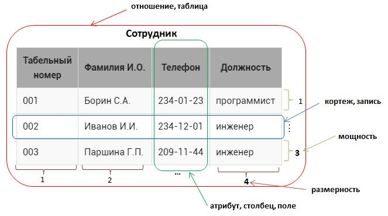
                      
На примере таблицы Сотрудник рассмотрим терминологию реляционных баз данных:

1. отношение (таблица)  – это структура данных целиком, набор записей , в  примере –это Сотрудник;
2. кортеж – это каждая строка , содержащая данные (более распространенный термин – запись ), например, <001, Борин С.А, 234-01-23, программист>, все кортежи в отношении должны быть различны;
3. мощность – число кортежей в таблице (проще говоря, число записей), в данном случае 3, мощность отношения может быть любой (от 0 до бесконечности), порядок следования кортежей - неважен;
4. атрибут – это столбец в таблице (более распространенный термин – поле ), в примере – Табельный номер, Фамилия И.О., Телефон, Должность) 
5. размерность – это число атрибутов в таблице, в данном случае – 4;
размерность отношения должна быть больше 0, порядок следования атрибутов существенен;
6. домен атрибута – это допустимые значения (неповторяющиеся), которые можно занести в поле , например для атрибута Должность домен – {инженер, программист}.
ps. академическая теория, скорее сбивает с привычных названий.

---

## Визуализации отношений в БД

Для визуализации отношений в базах данных есть много инструментов, в том числе — бесплатных и доступных онлайн. Например, на сайте quickdatabasediagrams.com. Диаграммы сущность связь.

---

## ER-диаграммы: схема базы данных
При проектировании БД таблицы и их связи изображают схематически; такие схемы называют ER-диаграммы (от англ. Entity-Relationship diagram, «диаграмма сущность — связь»). В схемах описываются таблицы, типы полей и связи с другими таблицами.

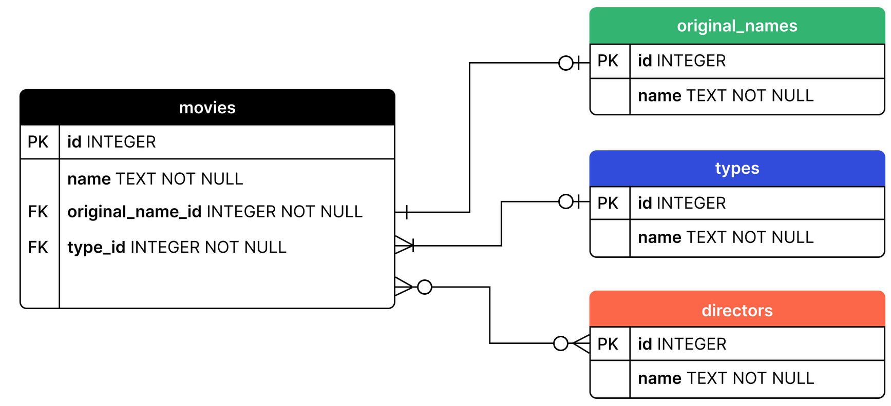

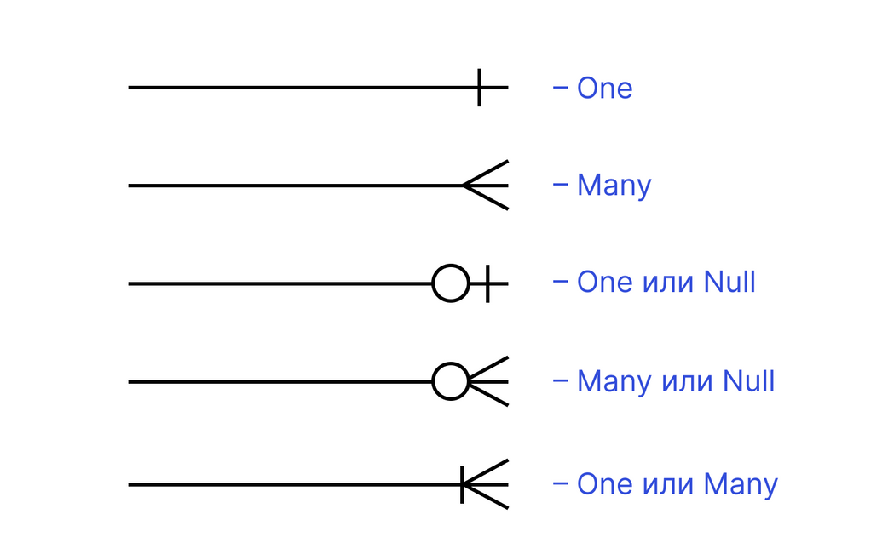

## Перечислите различные типы отношений в SQL.
1. Один к одному . Это можно определить как связь между двумя таблицами, где каждая запись в одной таблице связана с максимум одной записью в другой таблице.
2. «Один ко многим» и «Многие к одному» — это наиболее часто используемая связь, когда запись в таблице связана с несколькими записями в другой таблице.
3. «Многие ко многим » — используется в случаях, когда для определения отношения необходимо несколько экземпляров с обеих сторон.
4. Самореферентные отношения — используется, когда таблице необходимо определить отношения с самой собой.

---
## Что такое первичный ключ?
Первичный ключ или PRIMARY KEY предназначен для однозначной идентификации каждой записи в таблице и является строго уникальным (UNIQUE): две записи таблицы не могут иметь одинаковые значения первичного ключа. Нулевые значения (NULL) в PRIMARY KEY не допускаются. Если в качестве PRIMARY KEY используется несколько полей, их называют составным ключом.

Важное свойство первичного ключа — уникальность, но для внешнего ключа это необязательно.

---
## Когда используется PRIMARY KEY?
PRIMARY KEY — это первичный ключ, который используется в качестве основного ключа и может быть использован для связи с дочерней таблицей, содержащей внешний ключ.
```
CREATE TABLE USERS (
  id INT NOT NULL,
  name VARCHAR (20) NOT NULL,
  PRIMARY KEY (id)
);
```

---
## Что такое внешний ключ?
Внешний ключ или FOREIGN KEY также является атрибутом ограничения и обеспечивает связь двух таблиц. По сути, это поле или несколько полей, которые ссылаются на PRIMARY KEY в родительской таблице

```
CREATE TABLE order (
  order_id INT NOT NULL,
  user_id INT,
  PRIMARY KEY (order_id),
  FOREIGN KEY (user_id) REFERENCES users(id)
);
```
---
## Ограничение по умолчанию

1. UNIQUE — гарантирует уникальность значений в столбце;
2. NOT NULL — значение не может быть NULL;
3. INDEX — создаёт индексы в таблице для быстрого поиска/запросов;
4. CHECK — значения столбца должны соответствовать заданным условиям;
5. DEFAULT — предоставляет столбцу значения по умолчанию.

---
## Назовите четыре основных типа соединения в SQL
Чтобы объединить две таблицы в одну, следует использовать оператор JOIN. Соединение таблиц может быть внутренним (INNER) или внешним (OUTER), причём внешнее соединение может быть левым (LEFT), правым (RIGHT) или полным (FULL).

1. INNER JOIN — получение записей с одинаковыми значениями в обеих таблицах, т.е. получение пересечения таблиц.
2. FULL OUTER JOIN — объединяет записи из обеих таблиц (если условие объединения равно true) и дополняет их всеми записями из обеих таблиц, которые не имеют совпадений. Для записей, которые не имеют совпадений из другой таблицы, недостающее поле будет иметь значение NULL.
3. LEFT JOIN — возвращает все записи, удовлетворяющие условию объединения, плюс все оставшиеся записи из внешней (левой) таблицы, которые не удовлетворяют условию объединения.
4. RIGHT JOIN — работает точно так же, как и левое объединение, только в качестве внешней таблицы будет использоваться правая.

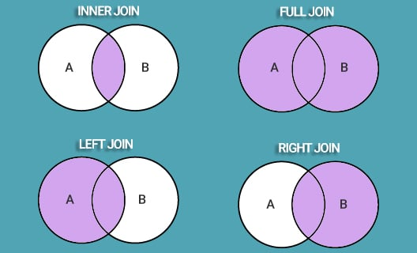

Рассмотрим пример соединения SQL таблиц с использованием INNER JOIN. Следующий запрос выбирает все заказы с информацией о клиенте:
```
SELECT Orders.OrderID, Customers.CustomerName
FROM Orders
INNER JOIN Customers ON Orders.CustomerID = Customers.CustomerID;
```
---
## Что такое Self JOIN?
Это выражение используется для того, чтобы таблица объединилась сама с собой, словно это две разные таблицы. Чтобы такое реализовать, одна из таких «таблиц» временно переименовывается.

Например, следующий SQL-запрос объединяет клиентов из одного города:

```
SELECT A.CustomerName AS CustomerName1, B.CustomerName AS CustomerName2, A.City
FROM Customers A, Customers B
WHERE A.CustomerID <> B.CustomerID
AND A.City = B.City
ORDER BY A.City;
```
---
## CROSS JOIN - перекрёстное соединение
Во время перекрёстного соединения каждая строка одной таблицы соединяется с каждой строкой второй таблицы, давая тем самым в результате все возможные сочетания строк двух таблиц.

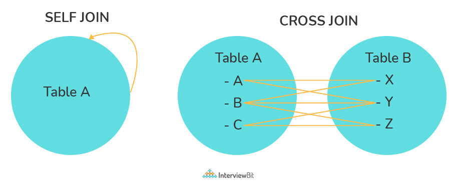

В чем разница между перекрестным (cross join) и естественным (natural join) соединением?

Перекрестное соединение создает перекрестное или декартово произведение двух таблиц, тогда как естественное соединение основано на всех столбцах, имеющих одинаковое имя и типы данных в обеих таблицах.

---
##  Что такое команды UNION, MINUS и INTERSECT?
Оператор UNION объединяет и возвращает набор результатов. Он используется для объединения полученных данных из двух или более запросов, которые должны иметь одинаковое количество столбцов с одинаковыми типами данных и расположенных в том же порядке.

Пример использования:
```
SELECT name, city FROM first_table
UNION
SELECT price, date FROM second_table;
```
### В чем разница между UNION и UNION ALL?

Оператор UNION ALL выдаст нам результат обоих выражений SELECT, причем дубликаты сохранятся.
```
SELECT * FROM student_details1
UNION ALL
SELECT * FROM student_details2
```
### Оператор MINUS 
Используется для удаления дубликатов из набора результатов, полученного вторым запросом SELECT, из набора результатов, полученного первым запросом SELECT, а затем возврата отфильтрованных результатов из первого.

### Оператор INTERSECT 
Объединяет результирующий набор, полученный двумя операторами SELECT, где записи одного совпадают с другим, а затем возвращает это пересечение результирующих наборов.

Перед выполнением любого из приведенных выше операторов в SQL необходимо выполнить определенные условия.
1. Каждый оператор SELECT в предложении должен иметь одинаковое количество столбцов.
2. Столбцы также должны иметь похожие типы данных.
3. Столбцы в каждом операторе SELECT обязательно должны иметь одинаковый порядок.

 ---
## Как работают подстановочные знаки?
Это специальные символы, которые нужны для замены каких-либо знаков в запросе. Они используются вместе с оператором LIKE, с помощью которого можно отфильтровать запрашиваемые данные.

Какими бывают подстановочные знаки?
    % — заменить ноль или более символов;
    _ — заменить один символ.

Примеры:
```
SELECT * FROM user WHERE name LIKE '%test%';
```
Данный запрос позволяет найти данные всех пользователей, имена которых содержат в себе «test».
```
SELECT * FROM user WHERE name LIKE 't_est';
```
А в этом случае имена искомых пользователей начинаются на «t», после содержат какой-либо символ и «est» в конце.

---
## Что делают псевдонимы Aliases?
SQL-псевдонимы нужны для того, чтобы дать временное имя таблице или столбцу. Это нужно, когда в запросе есть таблицы или столбцы с неоднозначными именами. В этом случае для удобства в составлении запроса используются псевдонимы. SQL-псевдоним существует только на время запроса.
```
SELECT very_long_column_name AS alias_name
FROM table;
```
---
## Для чего нужен оператор INSERT INTO SELECT?

Данный оператор копирует данные из одной таблицы и вставляет их в другую, при этом типы данных в обеих таблицах должны соответствовать.

Пример использования:
```
INSERT INTO second_table
SELECT * FROM first_table
WHERE condition;
```
---
## в чем разница между HAVING и WHERE

Если в запросе не используется GROUP BY, то условия WHERE и HAVING эквивалентны.

Но при использовании GROUP BY:

Условие HAVING используется для фильтрации значений из группы (т. е. для проверки условий после выполнения агрегации в группы).
Условие WHERE используется для фильтрации записей из результата до срабатывания какой-либо группировки.

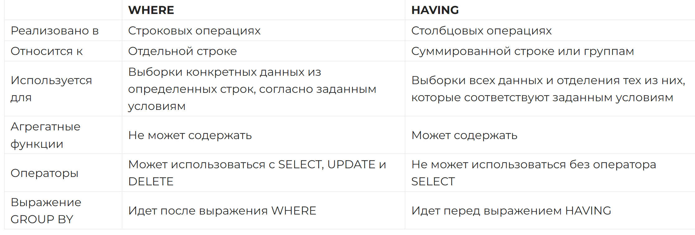


---

## Что такое нормализация и денормализация? 
Нормализация базы данных — это стратегия эффективной организации данных в базе данных. Цель состоит в том, чтобы уменьшить количество избыточных данных, чтобы одни и те же данные не хранились в нескольких таблицах. Вместо этого на данные будет ссылаться первичный ключ. Это удаление избыточных данных, устранение дублей, идентификация наборов связанных данных через PRIMARY KEY, etc.

Например, таблица с именем orders может иметь столбец с именем user_id . Вместо того, чтобы хранить копию пользовательских данных в таблице заказов, мы можем просто ссылаться на эти данные из другой таблицы с помощью соединения.

Соответственно, денормализация является обратным процессом, который вносит в нормализованную таблицу избыточные данные (для ускорения работы как правило).

### типы нормализации

Существует много последовательных уровней нормализации. Это так называемые нормальные формы. Каждая последующая нормальная форма включает предыдущую. Первых трех нормальных форм обычно достаточно.

Первая нормальная форма (1NF) — нет повторяющихся групп в строках
Вторая нормальная форма (2NF) — каждое неключевое (поддерживающее) значение столбца зависит от всего первичного ключа.
Третья нормальная форма (3NF) — каждое неключевое значение зависит только от первичного ключа и не имеет зависимости от другого неключевого значения столбца.

## Схема Снежинка и Схема Звезда

В Снежинке данные нормализованы связанными таблицами. В Звезде данные почти всегда денормализованы (для ускорения производительности).

---
## DELETE и TRUNCATE Объясните разницу между командами 

TRUNCATE удаляет все строки из таблицы.
Команда DELETE используется для удаления одной или всех строк в таблице.
Команда DROP удаляет таблицу из базы данных. Все строки таблицы, индексы и привилегии удаляются.

Команда DELETE — это DML-операция, которая удаляет записи из таблицы, соответствующие заданному условию:
```
DELETE FROM table_name WHERE condition;
```
При этом создаются логи удаления, то есть операцию можно отменить.

А вот команда TRUNCATE — это DDL-операция, которая полностью пересоздаёт таблицу, и отменить такое удаление невозможно:
```
TRUNCATE TABLE table_name;
```

DELETE используется для удаления одной или большего числа существующих таблиц.
TRUNCATE удаляет все данные внутри таблицы.
Между DELETE и TRUNCATE существуют следующие различия:

TRUNCATE — это команда DDL, а DELETE — команда DML.
При помощи TRUNCATE мы не можем активировать триггер, а с DELETE можем.
TRUNCATE не будет работать, если таблица содержит внешние ключи. В этом случае придется использовать DELETE.

---
## Видах команд SQL
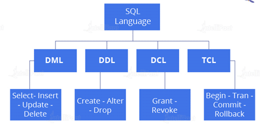

### DDL - Операторы определения данных (Data Definition Language)
DDL — это часть SQL, которая служит для определения структуры данных в начальном состоянии, когда база данных только создается. Операторы определения данных используются, главным образом, для создания и реструктуризации объектов базы данных. К этим операторам относятся CREATE, ALTER и DROP.

CREATE служит для создания объектов базы данных, ALTER — для их изменения, DROP — для удаления.

### DML - манипуляции данными (Data Manipulation Language)
DML используется для работы с уже существующими данными, содержащимися в базе данных. С помощью этих операторов пользователи могут получать данные из базы и совершать над ними какие-то манипуляции. К этим операторам относятся SELECT, INSERT, UPDATE, DELETE.

Оператор INSERT позволяет вносить данные в базу данных, UPDATE — обновлять их, DELETE — удалять данные из базы.

### DCL - определения доступа к данным (Data Control Language)
DCL используется для контроля доступа к данным в базе данных. Команды DCL обычно служат для создания объектов, имеющих отношение к доступу пользователей к базе, а также к распределению разрешений между пользователями. Для этих операций используются операторы GRANT и REVOKE. Первый служит для «выдачи» разрешений, а второй — для их отзыва.

###  TCL - управления транзакциями (Transaction Control Language, )
TCL используется для контроля изменений, осуществленных при помощи DML. Также с помощью TCL происходит объединение операторов в логические транзакции. К операторам управления транзакциями относятся COMMIT, ROLLBACK, SAVEPOINT, BEGIN, TRANSACTION.

---
## Чем отличаются DISTINCT и UNIQUE?
DISTINCT – это ключевое слово, которым мы пользуемся, если хотим вернуть уникальные значения на выводе. Оно отсеивает все повторяющиеся значения в конкретном столбце.

UNIQUE – это ограничение, которым пользуются, чтобы все значения столбца отличались. Оно похоже на PRIMARY KEY, с той лишь разницей, что в таблице может быть множество разных столбцов с UNIQUE.

---
## Для чего нужны оконные функции?
Оконная функция в SQL - функция, которая работает с выделенным набором строк (окном, партицией) и выполняет вычисление для этого набора строк в отдельном столбце.

При использовании агрегирующих функций предложение GROUP BY сокращает количество строк в запросе с помощью их группировки. При использовании оконных функций количество строк в запросе не уменьшается по сравнению с исходной таблицей

Оконные функции (windows functions) нужны в случаях, когда вы хотите сохранить значения своей исходной таблицы и параллельно отобразить сгруппированную или суммарную информацию. Они похожи на агрегатные функции, но не сокращают количество строк в результате, а объединяют и группируют их в несколько результатов.


[Оконные функции SQL простым языком с примерами / Хабр](https://habr.com/ru/articles/664000/)

```SQL
SELECT
Название функции (столбец для вычислений) 
OVER (
      PARTITION BY столбец для группировки
      ORDER BY столбец для сортировки
      ROWS или RANGE выражение для ограничения строк в пределах группы
      )
```
[Учимся применять оконные функции – This is Data](http://thisisdata.ru/blog/uchimsya-primenyat-okonnyye-funktsii/)

---

## Что такое индекс? Расскажите о его различных видах.
Индекс базы данных — это структура данных, обеспечивающая быстрый поиск данных в столбце или столбцах таблицы. Это повышает скорость операций доступа к данным из таблицы базы данных за счет дополнительных операций записи и памяти для поддержания структуры данных индекса.

1. Уникальный и неуникальный индекс:
Уникальные индексы — это индексы, которые помогают поддерживать целостность данных, гарантируя, что никакие две строки данных в таблице не имеют одинаковых значений ключей. После определения уникального индекса для таблицы уникальность применяется при каждом добавлении или изменении ключей в индексе.

2. Кластеризованный и некластеризованный индекс:
Кластерные индексы — это индексы, в которых порядок строк в базе данных соответствует порядку строк в индексе. Вот почему в данной таблице может существовать только один кластеризованный индекс, тогда как в таблице может существовать несколько некластеризованных индексов.

Единственная разница между кластеризованными и некластеризованными индексами заключается в том, что менеджер баз данных пытается хранить данные в базе данных в том же порядке, в котором соответствующие ключи появляются в кластеризованном индексе.

Кластеризация индексов может повысить производительность большинства операций запросов, поскольку они обеспечивают путь линейного доступа к данным, хранящимся в базе данных.

### В чем разница между кластеризованным и некластеризованным индексом?
Как объяснялось выше, различия можно разбить на три небольших фактора:

1. Кластерный индекс изменяет способ хранения записей в базе данных на основе индексированного столбца. 
2. Некластеризованный индекс создает в таблице отдельный объект, который ссылается на исходную таблицу.
3. Кластерный индекс используется для простого и быстрого извлечения данных из базы данных, в то время как выборка записей из некластеризованного индекса происходит относительно медленнее.

В SQL таблица может иметь один кластеризованный индекс, тогда как она может иметь несколько некластеризованных индексов. 

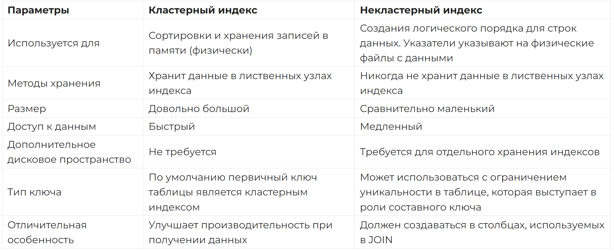

### Важен ли в составном индексе порядок столбцов?
Важен. Когда строится составной индекс, сначала индексируется первый столбец, а потом строятся индексы других столбцов, на основании главного (первого).

---
## Расскажите, чем отличаются SQL и PL/SQL

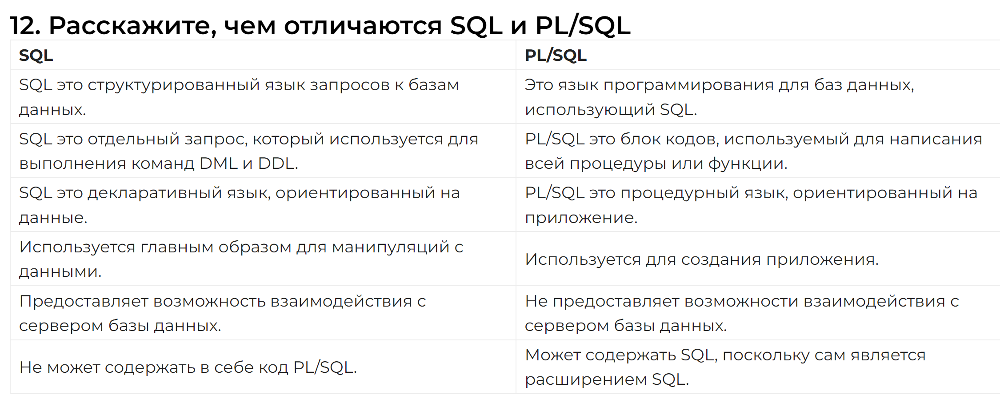

---
## Что такое запрос?
Запрос — это запрос данных или информации из таблицы базы данных или комбинации таблиц. Запрос к базе данных может быть либо запросом выбора, либо запросом действия.

### Что такое подзапрос? Каковы его виды?
Подзапрос — это запрос внутри другого запроса, также известный как вложенный запрос или внутренний запрос . Он используется для ограничения или расширения данных, запрашиваемых основным запросом, таким образом ограничивая или улучшая вывод основного запроса соответственно. 


1. Коррелированный подзапрос не может рассматриваться как независимый запрос, но он может ссылаться на столбец в таблице , указанный в FROM основного запроса.
2. Некоррелированный подзапрос можно рассматривать как независимый запрос , а вывод подзапроса подставляется в основной запрос.

---
## Какие общие предложения используются с запросом SELECT в SQL?
Вот некоторые общие предложения SQL, используемые в сочетании с запросом SELECT:

Предложение WHERE в SQL используется для фильтрации необходимых записей на основе определенных условий.
Предложение ORDER BY в SQL используется для сортировки записей по некоторым полям в порядке возрастания ( ASC ) или убывания ( DESC) .
Предложение GROUP BY в SQL используется для группировки записей с идентичными данными и может использоваться в сочетании с некоторыми функциями агрегирования для получения сводных результатов из базы данных.
Предложение HAVING в SQL используется для фильтрации записей в сочетании с предложением GROUP BY. Он отличается от WHERE тем, что предложение WHERE не может фильтровать агрегированные записи.


---
## Что такое Курсор? Как использовать Курсор?
Курсор базы данных — это управляющая структура, позволяющая просматривать записи в базе данных. Курсоры, кроме того, облегчают обработку после обхода, такую как поиск, добавление и удаление записей базы данных. Их можно рассматривать как указатель на одну строку в наборе строк.

Работа с SQL-курсором:
1. DECLARE курсор после объявления любой переменной. Объявление курсора всегда должно быть связано с оператором SELECT.
2. Откройте курсор, чтобы инициализировать результирующий набор. Оператор OPEN должен вызываться перед выборкой строк из результирующего набора.
3. Оператор FETCH для извлечения и перехода к следующей строке в результирующем наборе.
4. Вызовите оператор CLOSE , чтобы деактивировать курсор.
5. Наконец, используйте оператор DEALLOCATE , чтобы удалить определение курсора и освободить связанные ресурсы.

---
## Что такое представление?
Представление в SQL — это виртуальная таблица, основанная на наборе результатов оператора SQL. Представление содержит строки и столбцы, как настоящая таблица. Поля в представлении — это поля из одной или нескольких реальных таблиц в базе данных.

### чем отличаются представления и таблицы

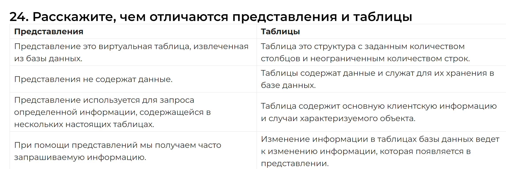

## Материализованное представление

Материализованное представление — в отличие от представления, является «слепком» данных на определенный момент времени, который хранящимся физически в виде отдельной таблицы и не изменяется при изменении базовой версии.

Преимущества:

1. быстрота выборки: материализованное представление может быть сформировано на основе сложного подзапроса, и, из-за того, что данные будут сохранены, этот запрос не будет пересчитываться повторно;
2. возможность «фиксации» данных;

Недостатки:

1. для работы с актуальными данными, появляется необходимость обновления материализованное представление;
2. физически хранимые данные могут занимать большие объемы памяти;

---
## Временные таблицы

Временная таблица помогает нам хранить и обрабатывать промежуточные результаты. Эти временные таблицы могут автоматически удаляться, когда в них больше нет необходимости.

Следующий запрос создаст временную таблицу:
```
CREATE TABLE #book(b_id int, b_cost int)
```
---
## Что такое AUTO_INCREMENT?
AUTO_INCREMENT используется в SQL для автоматической генерации уникального номера при каждом добавлении записи в таблицу.

Поскольку первичный ключ уникален для каждой записи, мы добавляем это поле в качестве AUTO_INCREMENT поля, таким образом при каждой вставке новой записи номер будет увеличиваться автоматически.

По умолчанию значение AUTO-INCREMENT начинается с 1 и увеличивается на 1 при каждом добавлении новой записи.

---
## Что такое хранимая процедура?
Хранимая процедура - это объект базы данных, представляющий собой набор SQL-инструкций, который компилируется один раз и хранится на сервере. Хранимые процедуры очень похожи на обыкновенные процедуры языков высокого уровня, у них могут быть входные и выходные параметры и локальные переменные, в них могут производиться числовые вычисления и операции над символьными данными, результаты которых могут присваиваться переменным и параметрам.

Синтаксис:
```
CREATE PROCEDURE procedure_name
AS
Sql_statement
GO;
```
Для выполнения процедуры используется следующий синтаксис:
```
EXEC procedure_name
```
Что такое рекурсивная хранимая процедура?

Рекурсивная хранимая процедура - это хранимая процедура, которая вызывает сама себя. 

---
## Разница между OLTP и OLAP

OLTP расшифровывается как Online Transaction Processing — обработка транзакций в реальном времени. Можно сказать, что это категория приложений, эффективных для поддержки программ, ориентированных на транзакции. Один из самых важных атрибутов OLTP-системы это ее возможности в плане поддержки прочности.

OLTP-системы часто придерживаются децентрализованного планирования, чтобы избежать единых точек отказа. Такие системы, как правило, предназначены для большой аудитории конечных пользователей, которые осуществляют короткие транзакции. Запросы к таким базам данных, как правило, просты, требуют быстрого выполнения и возвращают сравнительно немного записей. Таким образом, мерилом эффективности для этих систем служит количество транзакций в секунду.

OLAP расшифровывается как Online Analytical Processing — интерактивная аналитическая обработка.

Это категория программ, которые характеризуются сравнительно меньшей частотой онлайн-транзакций. Эффективность систем OLAP зависит от времени отклика. Такие системы обычно используются для интеллектуального анализа данных, обычно — в многомерных схемах.

---
## Что такое план запросов? 
План запросов – это "карта", отображающая графически или в виде текста способы получения данных, последовательность операций, сортировки, группировки и т. д. Во многих системах SQL план выполнения можно получить с помощью ключевого слова EXPLAIN.

---
## Чем отличается IN от EXISTS?

IN:

- Работает результирующим набором.
- Не применяется во вложенных запросах.
- Сравнивает все значения в списке результатов
- Имеет сравнительно низкую производительность при работе с большими результатами и подзапросами.

EXISTS:

- Работает с виртуальными таблицами.
- Используется со связанными запросами.
- Выводит результаты сравнения, если true.
- Обладает высокой производительностью, что облегчает обработку больших подзапросов.

---

## Чем NULL отличается от 0?
0 - это число.
NULL - это не число, а также NULL не является значением пустой строки. NULL используется для указания того, что данные отсутствуют, неизвестны, неприменимы. NULL не равен ничему, даже другому NULL.

---
## Как создать пустые таблицы с той же структурой, что и у другой таблицы?

Создание пустых таблиц с одинаковой структурой может быть выполнено путём извлечения записей из одной таблицы в новую таблицу с помощью оператора INTO, установив при этом значение WHERE для всех записей равным false. 

```
SELECT * INTO Students_copy FROM Students WHERE 1 = 2;
```
---
## Что такое профилирование запросов?
Профилирование запросов — это процесс анализа и оптимизации SQL-запросов, чтобы повысить производительность и эффективность работы с базой данных.

Во время профилирования вы можете изучать структуру запроса, время выполнения, использование индексов и другие аспекты, которые могут влиять на производительность запроса.

подробнее - [Профилирование SQL-запросов - Zalki-Lab](https://zalki-lab.ru/profiling-sql-queries/)

---

## 

---
## Что такое транзакции

Транзакции — это операции, которые выполняются на данных в базе данных и поддерживают свойства ACID (Atomicity, Consistency, Isolation, Durability). В SQL-базах данных транзакции могут быть поддержаны с помощью механизмов специальных языковых конструкций (например, в SQL есть операторы BEGIN TRANSACTION, COMMIT и ROLLBACK).

---
## Что такое ACID?


ACID или 4 свойства транзакций

1. Atomicity (атомарность) - транзакция должна быть выполнена целиком или не выполнена вовсе.

2. Consistency (согласованность) - гарантирует, что по мере выполнения транзакций, данные переходят из одного согласованного состояния в другое, то есть транзакция не может разрушить взаимной согласованности данных. Списание и зачисление  – это две разные транзакции, поэтому первая транзакция пройдёт без ошибок, а второй просто не будет. Именно поэтому крайне важно учитывать это свойство и поддерживать баланс системы.

3. Isolation (изолированность) - локализация пользовательских процессов означает, что конкурирующие за доступ к БД транзакции физически обрабатываются последовательно, изолированно друг от друга, но для пользователей это выглядит, как будто они выполняются параллельно.

4. Durability (долговечность) — устойчивость к ошибкам — если транзакция завершена успешно, то те изменения в данных, которые были ею произведены, не могут быть потеряны ни при каких обстоятельствах.

---
## Что такое BASE?
Что то из SQLAlchemy ?

Alchemy models
Чтобы создать модели, которые будут представлять SQL-таблицы в нашем Python-коде, предварительно необходимо создать базовый класс для всех моделей. Обычно его называют Base, и все модели приложения наследуют от этого класса. Этот declarative base class содержит справочник всех «своих» таблиц и соответствующих ему классов. Обычно Base один на приложение, его заводят в общем модуле. 

подробнее - [SQL в SQLAlchemy / Хабр](https://habr.com/ru/companies/domclick/articles/581304/)

---
## В чем разница между типом данных CHAR и VARCHAR в SQL?
И Char, и Varchar служат символьными типами данных, но varchar используется для строк символов переменной длины, тогда как Char используется для строк фиксированной длины

---
##  Что подразумевается под целостностью данных?

Целостность данных определяет точность, а также согласованность данных, хранящихся в базе данных. Она также определяет ограничения целостности для обеспечения соблюдения бизнес-правил для данных, когда они вводятся в приложение или базу данных.

---
## Репликация и Шардинг
В основе масштабирования данных лежит тот же принцип, что и в основе масштабирования Web приложений. Это разделение данных на группы и выделение их на отдельные сервера. Существует две основные стратегии — репликация и шардинг.

### Репликация
Репликация позволяет создать полный дубликат базы данных. Так, вместо одного сервера у Вас их будет несколько. Чаще всего используют схему master-slave:

1. Master — это основной сервер БД, куда поступают все данные. Все изменения в данных (добавление, обновление, удаление) должны происходить на этом сервере.
2. Slave — это вспомогательный сервер БД, который копирует все данные с мастера. С этого сервера следует читать данные. Таких серверов может быть несколько.

Репликация позволяет использовать два или больше одинаковых серверов вместо одного. Операций чтения (SELECT) данных часто намного больше, чем операций изменения данных (INSERT/UPDATE). Поэтому, репликация позволяет разгрузить основной сервер за счет переноса операций чтения на слейв.
Следует отметить, что репликация сама по себе не очень удобный механизм масштабирования. Причиной тому — рассинхронизация данных и задержки в копировании с мастера на слейв. Зато это отличное средство для обеспечения отказоустойчивости. Вы всегда можете переключиться на слейв, если мастер ломается и наоборот. Чаще всего репликация используется совместно с шардингом именно из соображений надежности.

### Шардинг (sharding)
Шардинг (иногда шардирование) — это другая техника масштабирования работы с данными. Суть его в разделении (партиционирование) базы данных на отдельные части так, чтобы каждую из них можно было вынести на отдельный сервер. Этот процесс зависит от структуры Вашей базы данных и выполняется прямо в приложении в отличие от репликации.

1. Вертикальный шардинг

Вертикальный шардинг — это выделение таблицы или группы таблиц на отдельный сервер. Таблицу users Вы оставляете на одном сервере, а таблицы photos и albums переносите на другой. Для каждой таблицы или группы таблиц будет отдельное соединение из программы.

2. Горизонтальный шардинг

Горизонтальный шардинг — это разделение одной таблицы на разные сервера. Это необходимо использовать для огромных таблиц, которые не умещаются на одном сервере. Разделение таблицы на куски делается по такому принципу:

- На нескольких серверах создается одна и та же таблица (только структура, без данных).
- В приложении выбирается условие, по которому будет определяться нужное соединение (например, четные на один сервер, а нечетные — на другой).
- Перед каждым обращением к таблице происходит выбор нужного соединения.

Допустим, наше приложение работает с огромной таблицей, которая хранит фотографии пользователей. Мы подготовили два сервера (обычно они называются шардами) для этой таблицы. Для нечетных пользователей мы будем работать с первыми сервером, а для четных — со вторым. Таким образом, на каждом из серверов будет только часть всех данных о фотках пользователей. 

---
## Партиционирование \ Секционированние таблиц
Партиционирование – это метод разделения больших (исходя из количества записей, а не столбцов) таблиц на много маленьких. по неким выбранным администратором критериям. Партиционирование таблиц делит весь объем операций по обработке данных на несколько независимых и параллельно выполняющихся потоков, что существенно ускоряет работу СУБД. Для правильного конфигурирования параметров партиционирования необходимо, чтобы в каждом потоке было примерно одинаковое количество записей.

---
## Уровни изолированности транзакций

Теоретически, все транзакции должны быть изолированы друг от друга. Но в таком случае доступность данных значительно бы понизилась, поскольку операции чтения транзакции блокировали бы операции записи в других транзакциях, и наоборот. Если доступность данных является важным требованием, то это свойство можно ослабить, используя уровни изоляции. 

Уровень изоляции задает степень защищенности выбираемых транзакцией данных от возможности изменения другими транзакциями. 

Выбирая уровень транзакции, мы пытаемся прийти к консенсусу в выборе между высокой согласованностью данных между транзакциями и скоростью выполнения этих самых транзакций.

### Какие виды изолирования транзакций бывают?
1. Read uncommitted - Уровень, имеющий самую плохую согласованность данных, но самую высокую скорость выполнения транзакций. Название уровня говорит само за себя — каждая транзакция видит незафиксированные изменения другой транзакции (феномен грязного чтения). 
2. Read committed - Для этого уровня параллельно исполняющиеся транзакции видят только зафиксированные изменения из других транзакций. Таким образом, данный уровень обеспечивает защиту от грязного чтения.
3. Repeatable read - Уровень, позволяющий предотвратить феномен неповторяющегося чтения. Т.е. мы не видим в исполняющейся транзакции измененные и удаленные записи другой транзакцией. Но все еще видим вставленные записи из другой транзакции. Чтение фантомов никуда не уходит.
4. Serializable - Уровень, при котором транзакции ведут себя как будто ничего более не существует, никакого влияния друг на друга нет. В классическом представлении этот уровень избавляет от эффекта чтения фантомов.

### Побочные эффекты параллелизма

Все операции в базе происходят не мгновенно и при одновременном изменении данных различными пользователями возможны следующие побочные эффекты:

1. Потерянное обновление (lost update). 
Эффект проявляется при одновременном изменении одного блока данных разными транзакциями. Две транзакции выполняют одновременно UPDATE для одной и той же строки, и изменения, сделанные одной транзакцией, затираются другой

2. «Грязное» чтение (dirty read).
Это такое чтение, при котором могут быть считаны добавленные или изменённые данные из другой транзакции, которая впоследствии не подтвердится (откатится).

3. Неповторяющееся чтение (non-repeatable read).
Проявляется, когда при повторном чтении в рамках одной транзакции, ранее прочитанные данные, оказываются изменёнными.

4. Фантомное чтение (phantom reads).
Можно наблюдать, когда одна транзакция в ходе своего выполнения несколько раз выбирает множество строк по одним и тем же критериям. При этом другая транзакция в интервалах между этими выборками добавляет или удаляет строки, или изменяет столбцы некоторых строк, используемых в критериях выборки первой транзакции, и успешно заканчивается. В результате получится, что одни и те же выборки в первой транзакции дают разные множества строк.

5. аномалия сериализации - Результат успешной фиксации группы транзакций оказывается несогласованным при всевозможных вариантах исполнения этих транзакций по очереди. 


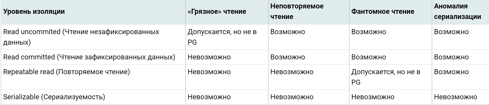


подробнее - [Уровни изолированности транзакций для самых маленьких / Хабр](https://habr.com/ru/articles/469415/)

еще - [Transact-SQL | Уровни изоляции](https://professorweb.ru/my/sql-server/2012/level3/3_16.php)

еще - [На пути к правильным SQL транзакциям (Часть 1) / Хабр](https://habr.com/ru/companies/infopulse/articles/261097/)

еще - [На пути к правильным SQL транзакциям (Часть 2) / Хабр](https://habr.com/ru/companies/infopulse/articles/261101/)

еще - [Postgres Pro Standard : Документация: 9.5: 13.2. Изоляция транзакций : Компания Postgres Professional](https://postgrespro.ru/docs/postgrespro/9.5/transaction-iso)

Acid, виды изоляции, шардирование верт/гор, индексы, партицирование, виды индексов, репликация.
    
[Что такое ACID? | Самый частый вопрос бэкендеру - YouTube](https://www.youtube.com/watch?v=gOB3hpAVIIQ)   

---

Понимание джойнов сломано. Это точно не пересечение кругов, честно -  https://habr.com/ru/articles/448072/

Во второй половине много вопросов по PostgreSQL - [Вопросы для собеседования по SQL в 2023 году — Machine learning на vc.ru](https://vc.ru/u/1389654-machine-learning/580137-voprosy-dlya-sobesedovaniya-po-sql-v-2023-godu)

---


## Что такое транзакция. Какие у неё есть свойства

- [Руководство по SQL. Транзакции](https://proselyte.net/tutorials/sql/sql-transactions/)

Транзакция является рабочей единицей работы с базой данных (далее – БД). Это последовательность операций, выполняемых в логическом порядке пользователем, либо программой, которая работает с БД.

Мы можем сказать, что транзакция – это распространение изменений в БД. Например, если мы создаём, изменяем или удаляем запись, то мы выполняем транзакцию. Крайне важно контролировать транзакции для гарантирования.

Основные концепции (свойства) транзакции описываются аббревиатурой ACID – Atomicity, Consistency, Isolation, Durability (Атомарность, Согласованность, Изолированность, Долговечность).

**Атомарность:**

Атомарность гарантирует, что любая транзакция будет зафиксирована только целиком (полностью). Если одна из операций в последовательности не будет выполнена, то вся транзакция будет отменена. Тут вводится понятие “отката” (rollback). Т.е. внутри последовательности будут происходить определённые изменения, но по итогу все они будут отменены (“откачены”) и по итогу пользователь не увидит никаких изменений.

**Согласованность:**

Это означает, что любая завершённая транзакция (транзакция, которая достигла завершения транзакции – end of transaction) фиксирует только допустимые результаты. Например, при переводе денег с одного счёта на другой, в случае, если деньги ушли с одного счёта, они должны прийти на другой (это и есть согласованность системы). Списание и зачисление  – это две разные транзакции, поэтому первая транзакция пройдёт без ошибок, а второй просто не будет. Именно поэтому крайне важно учитывать это свойство и поддерживать баланс системы.

**Изолированность:**

Каждая транзакция должна быть изолирована от других, т.е. её результат не должен зависеть от выполнения других параллельных транзакций. На практике, изолированность крайне труднодостижимая вещь, поэтому здесь вводится понятие “уровни изолированности” (транзакция изолируется не полностью).

**Долговечность:**

Эта концепция гарантирует, что если мы получили подтверждение о выполнении транзакции, то изменения, вызванные этой транзакцией не должны быть отменены из-за сбоя системы (например, отключение электропитания).

## Какие команды управления транзакциями вы знаете

- [Руководство по SQL. Транзакции](https://proselyte.net/tutorials/sql/sql-transactions/)

Для управления транзакциями используются следующие команды:

- COMMIT: Сохраняет изменения
- ROLLBACK: Откатывает (отменяет) изменения
- SAVEPOINT: Создаёт точку к которой группа транзакций может откатиться
- SET TRANSACTION: Размещает имя транзакции.

Команды управление транзакциями используются только для DML команд: INSERT, UPDATE, DELETE. Они не могут быть использованы во время создания, изменения или удаления таблицы.

## Что такое уровни изолированности транзакций. Какие они бывают

"Высоконагруженные приложения". М. Клеппман. Глава 7

*Изоляция* в смысле ACID означает, что конкурентно выполняемые транзакции изолированы друг от друга — они не могут помешать друг другу. Классические учебники по базам данных понимают под изоляцией сериализуемость (serializability). То есть каждая транзакция выполняется так, будто она единственная во всей базе. БД гарантирует, что результат фиксации транзакций такой же, как если бы они выполнялись последовательно (serially, одна за другой), хотя в реальности они могут выполняться конкурентно.

**Чтение зафиксированных данных (read comitted):**

Самый базовый уровень изоляции транзакций — чтение зафиксированных данных. Он обеспечивает две гарантии.

- При чтении из БД клиент видит только зафиксированные данные (никаких «грязных» операций чтения).
- При записи в БД можно перезаписывать только зафиксированные данные (никаких «грязных» операций записи).

*«Грязные» операции чтения*. Клиент читает записанные другим клиентом данные до их фиксации. Уровень изоляции чтения зафиксированных данных и более сильные предотвращают «грязные» операции чтения.

*«Грязные» операции записи*. Клиент перезаписывает данные, которые другой клиент записал, но еще не зафиксировал. Практически все реализации транзакций предотвращают «грязные» операции записи.

**Изоляция снимков состояния и воспроизводимое чтение:**

Ее идея состоит в том, что каждая из транзакций читает данные из согласованного снимка состояния БД, то есть видит данные, которые были зафиксированы в базе на момент ее (транзакции) начала. Даже если данные затем были изменены другой транзакцией, каждая транзакция видит только старые данные, по состоянию на конкретный момент времени. Позволяет предотвратить асимметрии чтения.

*Асимметрия чтения* (невоспроизводимое чтение). Клиент видит различные части базы данных по состоянию на разные моменты времени. Чаще всего такую проблему предотвращают с помощью изоляции снимков состояния, при которой транзакция читает данные из согласованного снимка состояния, соответствующего определенному моменту времени. Обычно это реализуется благодаря многоверсионному управлению конкурентным доступом (MVCC).

**Сериализуемость (serializability):**

Обычно считается самым сильным уровнем изоляции. Она гарантирует, что даже при конкурентном выполнении транзакций результат останется таким же, как и в случае их последовательного (по одной за раз) выполнения, без всякой конкурентности. Следовательно, база данных гарантирует, что правильно выполняющиеся последовательно транзакции будут столь же правильно выполняться конкурентно. Другими словами, база предотвращает все возможные состояния гонки.

Большинство современных БД, обеспечивающих сериализуемость, применяют один из трех методов:

- По-настоящему последовательное выполнение транзакций. Если вы можете сделать отдельные транзакции очень быстрыми, причем количество транзакций, обрабатываемых за единицу времени на одном ядре CPU, достаточно невелико, то для обработки этот вариант окажется простым и эффективным.
- Двухфазная блокировка. На протяжении десятилетий она была стандартным способом обеспечения сериализуемости, но многие приложения стараются ее не использовать из-за плохих показателей производительности.
- Сериализуемая изоляция снимков состояния (SSI). Довольно свежий алгоритм, лишенный практически всех недостатков предыдущих подходов. В нем используется оптимистический подход, благодаря чему транзакции выполняются без блокировок. Перед фиксацией транзакции выполняется проверка, и если выполнение было несериализуемым, то транзакция прерывается без фиксации.

## Что такое вложенные транзакции

Вложенными называются транзакции, выполнение которых инициируется из тела уже активной транзакции .

Для создания вложенной транзакции пользователю не нужны какие-либо дополнительные команды. Он просто начинает новую транзакцию, не закрыв предыдущую. Завершение транзакции верхнего уровня откладывается до завершения вложенных транзакций. Если транзакция самого нижнего ( вложенного ) уровня завершена неудачно и отменена, то все транзакции верхнего уровня, включая транзакцию первого уровня, будут отменены. Кроме того, если несколько транзакций нижнего уровня были завершены успешно (но не зафиксированы), однако на среднем уровне (не самая верхняя транзакция ) неудачно завершилась другая транзакция, то в соответствии с требованиями ACID произойдет откат всех транзакций всех уровней, включая успешно завершенные. Только когда все транзакции на всех уровнях завершены успешно, происходит фиксация всех сделанных изменений в результате успешного завершения транзакции верхнего уровня.

Каждая команда COMMIT TRANSACTION работает только с последней начатой транзакцией. При завершении вложенной транзакции команда COMMIT применяется к наиболее "глубокой" вложенной транзакции. Даже если в команде COMMIT TRANSACTION указано имя транзакции более высокого уровня, будет завершена транзакция, начатая последней.

## Что такое курсор и зачем он нужен

Запрос к реляционной базе данных обычно возвращает несколько рядов (записей) данных, но приложение за один раз обрабатывает лишь одну запись. Даже если оно имеет дело одновременно с несколькими рядами (например, выводит данные в форме электронных таблиц), их количество по-прежнему ограничено. Кроме того, при модификации, удалении или добавлении данных рабочей единицей является ряд. В этой ситуации на первый план выступает концепция курсора, и в таком контексте курсор – указатель на ряд.

Курсор в SQL – это область в памяти базы данных, которая предназначена для хранения последнего оператора SQL. Если текущий оператор – запрос к базе данных, в памяти сохраняется строка данных запроса, называемая текущим значением, или текущей строкой курсора. Указанная область в памяти поименована и доступна для прикладных программ.

Обычно курсоры используются для выбора из базы данных некоторого подмножества хранимой в ней информации. В каждый момент времени прикладной программой может быть проверена одна строка курсора. Курсоры часто применяются в операторах SQL, встроенных в написанные на языках процедурного типа прикладные программы. Некоторые из них неявно создаются сервером базы данных, в то время как другие определяются программистами.

В некоторых случаях применение курсора неизбежно. Однако по возможности этого следует избегать и работать со стандартными командами обработки данных: SELECT, UPDATE, INSERT, DELETE. Помимо того, что курсоры не позволяют проводить операции изменения над всем объемом данных, скорость выполнения операций обработки данных посредством курсора заметно ниже, чем у стандартных средств SQL.

## Какая разница между PostgreSQL и MySQL

- [Сравнение MySQL и PostgreSQL](https://hyperhost.ua/info/ru/sravnenie-mysql-i-postgresql)

**История разработки MySQL и PostgreSQL.**

MySQL начал создаваться еще в 90-х. Внутренний выпуск произошел в 1995 году. Тогда разработкой MySQL занимались несколько компаний. Начиная с 2010 года компания  Oracle владеет проектом MySQL и разрабатывает новые версии.

PostgreSQL немного ранее в 1986 году начал разрабатываться в Калифорнийском университете.  Над проектом работали более 8 лет, но потом был разделен на коммерческую БД IIlustra и свободный проект Postrgesql.

**Особенности хранения данных.**

В MySQL для хранения данных в таблицах используются различные движки. Движок не имеет влияния на синтаксис запросов и их выполнение. Имеется поддержка MyISAM, InnoDB, MEMORY, Berkeley DB. Их основное отличие в способе записи данных на диск и методов считывания. PostgreSQL работает только на движке storage engine. Таблицы организованы в виде обьектов, а действия выполняются с помощью объективно ориентированных функций.

**Стандарты SQL.**

SQL - это стандартизированный язык выполнения запросов, который используется и MySQL и PostgreSQL. Этот стандарт имеет несколько версий и был разработан еще в 1986 году.

MySQL имеет поддержку не всех функций и возможностей SQL. Это сделано для того, чтобы работать с MySQL было просто и удобно. Но если для проекта необходимо какое-то расширение, разработчики его могут добавить не в ущерб стандарту.

PostgreSQL поддерживает все новые стандарты SQL, из-за этого данный проект довольно сложный и не настолько популярный как MySQL.

**Возможности обработки данных.**

MySQL при исполнении запроса делает загрузку всего ответа сервера в память клиента. В случае больших обьемов это не всегда удобно. По функциям Postgresql более широкий чем Mysql. Например, в Postgresql при помощи курсора можно перемещать полученные данные. Вам предоставляется только указатель, а весь ответ хранится в памяти сервера баз данных. Данный указатель можно хранить между сеансами. Postgresql имеет поддержку регулярных выражений в запросах, рекурсивных запросов и наследования таблиц.

**Производительность MySQL и Postgresql.**

MySQL всегда был ориентирован на большую производительность, в то время как Postgresql был нацелен на большое количество настроек и стандартов. Но со временем эта ситуация поменялась и Postgre стал более производительным.

Для организации работы с базой данных в MySQL используется таблица InnoDB. А это значит, что MySQL будет значительно быстрее Postgre в случае использовании первичного ключа.

По поводу  Postgresql, вся заголовочная информация таблиц размещается в оперативной памяти. Можно применять несколько индексов к одной таблице для большего удобства. В общем PostgreSQL работает быстрее, кроме ситуаций с использованием первичных ключей.

**Поддерживаемые типы данных.**

MySQL и Postgresql имеют похожий набор, который, конечно же, имеет свои отличия. В Postgre типы более разнообразны и есть свои типы полей для определенных видов данных, которых, например, нет в MySQL.

## Что такое VACUUM в PostgreSQL

VACUUM высвобождает пространство, занимаемое «мёртвыми» кортежами. При обычных операциях Postgres кортежи, удалённые или устаревшие в результате обновления, физически не удаляются из таблицы; они сохраняются в ней, пока не будет выполнена команда VACUUM. Таким образом, периодически необходимо выполнять VACUUM, особенно для часто изменяемых таблиц.

## Что такое EXPLAIN. Какая разница между ним и EXPLAIN ANALYZE

EXPLAIN выводит информацию, необходимую для понимания, что же делает ядро при каждом конкретном запросе.

EXPLAIN ANALYZE выполняет объясняемое выражение, даже если это insert, update или delete.

## Какие виды Join'ов вы знаете, чем они отличаются друг от друга

- [Табличные выраженияl](https://postgrespro.ru/docs/postgresql/9.6/queries-table-expressions)

Слова INNER и OUTER необязательны во всех формах. По умолчанию подразумевается INNER (внутреннее соединение), а при указании LEFT, RIGHT и FULL — внешнее соединение.

Условие соединения указывается в предложении ON или USING, либо неявно задаётся ключевым словом NATURAL. Это условие определяет, какие строки двух исходных таблиц считаются «соответствующими» друг другу.

Возможные типы соединений с сопоставлениями строк:

*INNER JOIN*
Для каждой строки R1 из T1 в результирующей таблице содержится строка для каждой строки в T2, удовлетворяющей условию соединения с R1.

*LEFT OUTER JOIN*
Сначала выполняется внутреннее соединение (INNER JOIN). Затем в результат добавляются все строки из T1, которым не соответствуют никакие строки в T2, а вместо значений столбцов T2 вставляются NULL. Таким образом, в результирующей таблице всегда будет минимум одна строка для каждой строки из T1.

*RIGHT OUTER JOIN*
Сначала выполняется внутреннее соединение (INNER JOIN). Затем в результат добавляются все строки из T2, которым не соответствуют никакие строки в T1, а вместо значений столбцов T1 вставляются NULL. Это соединение является обратным к левому (LEFT JOIN): в результирующей таблице всегда будет минимум одна строка для каждой строки из T2.

*FULL OUTER JOIN*
Сначала выполняется внутреннее соединение. Затем в результат добавляются все строки из T1, которым не соответствуют никакие строки в T2, а вместо значений столбцов T2 вставляются NULL. И наконец, в результат включаются все строки из T2, которым не соответствуют никакие строки в T1, а вместо значений столбцов T1 вставляются NULL.

Предложение ON определяет наиболее общую форму условия соединения: в нём указываются выражения логического типа, подобные тем, что используются в предложении WHERE. Пара строк из T1 и T2 соответствуют друг другу, если выражение ON возвращает для них true.

USING — это сокращённая запись условия, полезная в ситуации, когда с обеих сторон соединения столбцы имеют одинаковые имена. Она принимает список общих имён столбцов через запятую и формирует условие соединения с равенством этих столбцов. Например, запись соединения T1 и T2 с USING (a, b) формирует условие ON T1.a = T2.a AND T1.b = T2.b.

Более того, при выводе JOIN USING исключаются избыточные столбцы: оба сопоставленных столбца выводить не нужно, так как они содержат одинаковые значения. Тогда как JOIN ON выдаёт все столбцы из T1, а за ними все столбцы из T2, JOIN USING выводит один столбец для каждой пары (в указанном порядке), за ними все оставшиеся столбцы из T1 и, наконец, все оставшиеся столбцы T2.

Наконец, NATURAL — сокращённая форма USING: она образует список USING из всех имён столбцов, существующих в обеих входных таблицах. Как и с USING, эти столбцы оказываются в выходной таблице в единственном экземпляре. Если столбцов с одинаковыми именами не находится, NATURAL JOIN действует как JOIN ... ON TRUE и выдаёт декартово произведение строк.

Еще есть cross join - декартово произведение.

# Redis когда он бывает полезен в Django

Redis не является заменой базы данных SQL, но предлагает быстрое резидентное хранилище, которое больше подходит для определенных задач. Добавьте его в свой стек и используйте тогда, когда действительно чувствуете, что это необходимо. Ниже приведено несколько сценариев, в которых Redis
бывает полезен.

- Подсчет количеств: как вы уже убедились, с помощью Redis очень легко управлять количествами. Команды incr() и incrby() можно использовать для подсчета элементов.
- Хранение последних элементов: с помощью команд lpush() и rpush() можно добавлять элементы в начало/конец списка. Удаление и возврат первого/последнего элемента осуществляются посредством команд lpop()/rpop(). Длину списка можно обрезать с использованием ltrim(), чтобы поддерживать заданную длину.
- Очереди: в дополнение к командам push и pop Redis предлагает блокирование команд очереди.
- Кеширование: применение команд expire() и expireat() позволяет использовать Redis в качестве кеша. Кроме того, существуют сторонние для Django механизмы кеширования Redis.
- Публикация/подписка: Redis предоставляет команды для подписки/отписки и отправки сообщений в каналы.
- Рейтинги и списки лидеров: сортированные множества Redis с баллами позволяют очень легко создавать списки лидеров.
- Отслеживание в режиме реального времени: благодаря быстрому вводу-выводу Redis идеально подходит для реально-временных сценариев.

---
#  Python Работа с базой данных


[Python: Работа с базой данных, часть 1/2: Используем DB-API / Хабр](https://habr.com/ru/articles/321510/)
[Python: Работа с базой данных, часть 2/2: Используем ORM / Хабр](https://habr.com/ru/articles/322086/)

