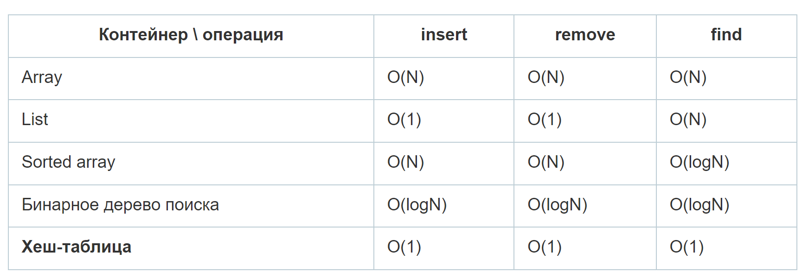

Алгоритмы и структуры данных
========================

## Основные структуры данных:
- Множества.
- Массивы. Сложность вставки в начало О(н), сложность О(н), - хранение в последовательных ячейках памяти, удаление из начала массива О(н), а из конца массива О(1)
- Связный список. В связном списке каждый элемент имеет значение и ссылку на следующий элемент списка,   последний ссылается на None. Элементы ты хранятся непоследовательно, получить доступ за О(1) не получится. 
- Стек. Эта структура данных работает по принципу LIFO: Last In First Out, то есть последний пришёл, первый вышел. Стек играет очень важную роль в рекурсии.
- Очередь и Дек. Очередь основана на концепции FIFO (с англ. First In First Out — «первый вошёл, первый вышел»).  То есть первым извлекают элемент, который добавили раньше всех. Сложность этой операции должна быть O(1).

  
##  Как работают типы данных хэшмап, связанный список, двусвязный список, массив?


##  Что такое О (о-большое)? Зачем и как используется?

О-большое описывает скорость работы алгоритма (не время).

1) ‰Скорость алгоритмов измеряется не в секундах, а в темпе роста количества операций.
2) ‰‰По сути формула описывает, насколько быстро возрастает время выполнения алгоритма с увеличением размера входных данных.
3) ‰‰Время выполнения алгоритмов выражается как «O-большое».
4) ‰‰Время выполнения O(log n) быстрее O(n), а с увеличением размера списка, в котором ищется значение, оно становится намного быстрее

##  Какая сложность вставки, извлечения, поиска элементов в словаре и списке?

O(1) - постоянная скорость
O(n) - линейный
O(LogN) - логарифмический (ака сколько раз надо умножить 2 на 2 чтобы получить n элементов в массиве)



##  Что такое распаковка коллекций?

Распаковка (unpacking, также называемая Деструктуризация) представляет разложение коллекции (кортежа, списка и т.д.) на отдельные значения.
 
 Запаковка используется всегда в функции, потому что она «запаковывает» все аргументы в один кортеж. Распаковка, соответственно, используется при вызове функции и «распаковывает» элементы из любой коллекции, которая поддерживает итерацию.

[Операторы (* и **) упаковки и распаковки коллекций](https://fullstacker.ru/operatory-upakovki-i-raspakovki-kollektsiy)

# Алгоритмы, структуры

"Грокаем алгоритмы. Адитья Бхаргава"

Алгоритм — это набор инструкций, предназначенный для выполнения некоторой задачи.  

Структуры данных: массив и связанный список. Структуры данных  -  По сути, они представляют собой способы хранения и организации данных, реализованные с помощью алгоритмов. 


[Визуализация 5 алгоритмов сортировки на Python / Хабр](https://habr.com/ru/companies/kts/articles/727528/)

## Что такое рекурсия. Какие минусы, плюсы

Рекурсия – когда функция вызывает саму себя. Логика рекурсивной функции как правило состоит из двух ветвей. Длинная ветвь вызывает эту же функцию с другими параметрами, чтобы накопить результат. Короткая ветвь определяет критерий выхода из рекурсии.

Рекурсия, **в некоторых случаях**, упрощает код и делает его декларативным. Рекурсия поощряет мыслить функционально и избегать побочных эффектов.

Неоптимизированная рекурсия приводит к накладным расходам ресурсов. При большом количестве итераций можно превысить лимит на число рекурсивных вызовов (recursion depth limit reached), но при возникновении такой необходимости скорее всего вы делаете что-то не так и лучше присмотритесь к другим инструментам (стэк, например).

## Что такое хвостовая рекурсия

Это особый вид рекурсии, когда функция заканчивается вызовом самой себя без дополнительных операторов. Когда это условие выполняется, компилятор разворачивает рекурсию в цикл с одним стек-фреймом, просто меняя локальные переменные от итерации к итерации.

Так, классическое определение рекурсивного факториала `return N * fact(N - 1)` не поддерживает хвостовую рекурсию, потому что для каждого стек-фрейма придется хранить текущее значение `N`.

Чтобы сделать рекурсии хвостовой, добавляют параметры-аккумуляторы. Благодаря им функция знает о своем текущем состоянии. Пусть параметр `acc` по умолчанию равен 1. Тогда запись с хвостовой рекурсией будет выглядеть так:

```python
def fact(N, acc=1):
    if N == 1:
        return acc
    else:
        return fact(N - 1, acc * N)
```

## Как можно оптимизировать хвостовую рекурсию в Python

- [Python — оптимизация хвостовой рекурсии](https://habr.com/ru/post/158385/)
- [Устранение Хвостовой рекурсии](https://habr.com/ru/post/111768/)

```python
class recursion(object):
    "Can call other methods inside..."
    def __init__(self, func):
        self.func = func

    def __call__(self, *args, **kwargs):
        result = self.func(*args, **kwargs)
        while callable(result): result = result()
        return result

    def call(self, *args, **kwargs):
        return lambda: self.func(*args, **kwargs)


@recursion
def sum_natural(x, result=0):
    if x == 0:
        return result
    else:
        return sum_natural.call(x - 1, result + x)

# Даже такой вызов не заканчивается исключением
# RuntimeError: maximum recursion depth exceeded
print(sum_natural(1000000))
```

## Простой поиск

О(n).

## Бинарный поиск

O(log n): работает только с отсортированным массивом. Берем средний элемент и проверяем не тот ли это элемент что мы ищем, если нет и он меньше чем тот который мы ищем - отбрасываем половину с меньшими значениями (если больше, то с большими) и повторяем пока не найдем искомый элемент.

```python
def binary_search(list, item):
  # low and high keep track of which part of the list you'll search in.
  low = 0
  high = len(list) - 1

  # While you haven't narrowed it down to one element ...
  while low <= high:
    # ... check the middle element
    mid = (low + high) // 2
    guess = list[mid]
    # Found the item.
    if guess == item:
      return mid
    # The guess was too high.
    if guess > item:
      high = mid - 1
    # The guess was too low.
    else:
      low = mid + 1

  # Item doesn't exist
  return None

my_list = [1, 3, 5, 7, 9]
print(binary_search(my_list, 3)) # => 1

# 'None' means nil in Python. We use to indicate that the item wasn't found.
print(binary_search(my_list, -1)) # => None
```

## Рекурсивные алгоритмы

Должны иметь базовый и рекурсивный случай. Если рекурсивный алгоритм не будет иметь базового случая, он будет выполняться вечно, так как не будет условия при котором нужно вернуть управление.

## Быстрая сортировка

На первом этапе выбирают опорный элемент. Чаще всего его берут из середины массива. Затем последовательно сравнивают первый элемент массива с последним, второй с предпоследним и т.д. Если элемент слева от опорного элемента больше правого, они меняются местами. Когда доходят до опорного элемента, итерация считается законченной.

Далее описанный выше алгоритм применяют для двух подмассивов. Первый – от первого элемента до опорного элемента (не включительно), второй – от опорного до последнего.

Рекурсивный спуск продолжается, пока длины подмассивов не станут равны единице.

Сложность быстрой сортировки в среднем случае равна `N * log(N)`.

O(n * log n) (средний и лучший случай), O(n^2) в худшем. Скорость зависит от выбора опорного элемента - в большистве случаев выполняется за среднее время.
Базовый случай - в массиве 0 или 1 элемент, тогда он уже отсортирован.

Алгоритм:

- Выбрать опорный элемент
- Разделить массив на два подмассива - с элементами меньше и больше опорного
- Рекурсивно применять быструю сортировку к двум подмассивам

*Доказательство по индукции:*

```python
def quicksort(array):
  if len(array) < 2:
    # base case, arrays with 0 or 1 element are already "sorted"
    return array
  else:
    # recursive case
    pivot = array[0]
    # sub-array of all the elements less than the pivot
    less = [i for i in array[1:] if i <= pivot]
    # sub-array of all the elements greater than the pivot
    greater = [i for i in array[1:] if i > pivot]
    return quicksort(less) + [pivot] + quicksort(greater)

print(quicksort([10, 5, 2, 3]))
```

## Граф

Моделирует набор связей. Они состоят из узлов и ребер. Узлы напрямую соединенные с другими узлами называются соседями.

Бывают направленные и ненаправленные, взвешенные и невзвешенные.

В направленном графе есть стрелки, а отношения действуют в направлении стрелки (А -> Б, значит Б - сосед А, а А - родитель Б)

В ненаправленном графе стрелок нет, а отношение идет в обе стороны

## Очередь и стек

Очередь FIFO (first in first out), стрек LIFO (last in first out)

## Дерево

Особая разновидность графа, в котором нет ребер, которые указывают в обратном направлении

## Поиск в ширину

O(V + E), где V - количество вершин, E - количество ребер, работает с графами и помогает ответить на вопросы двух типов:

- Существует ли путь от узла А к узлу Б?
- Как выглядит кратчайший путь от узла А к узлу Б?

*Алгоритм:*

- Поместить узел, с которого начинается поиск, в изначально пустую очередь.
- Извлечь из начала очереди узел u и пометить его как развёрнутый.
- Если узел u является целевым узлом, то завершить поиск с результатом «успех».
- В противном случае, в конец очереди добавляются все преемники узла u, которые ещё не развёрнуты и не находятся в очереди.
- Если очередь пуста, то все узлы связного графа были просмотрены, следовательно, целевой узел недостижим из начального; завершить поиск с результатом «неудача».
- Вернуться к п. 2.

Используется для нахождения кратчайшего пути в невзвешенном графе

## Алгоритм Дейкстры

Используется для нахождения пути с наименьшим весом в взвешенном графе
Работает только в направленных ациклических графах (DAG - Directed Acyclic Graph)

Состоит из 4 шагов:

- Найти узел с наименьшей стоимостью
- Обновить стоимость соседей этого узла
- Повторять пока это не будет сделано для всех узлов
- Вычислить итоговый путь

Не работает с отрицательными весами - для графов с отрицательными весами сущестувет специальный алгоритм, называемый *алгоритмом Беллмана-Форда*

## Жадные алгоритмы

Используются когда вычисление точного решения занимает слишком много времени или когда высокая точность не требуется. Эффективность приближенного алгоритма оценивается по:

- быстроте
- близости полученного решения к оптимальному

Жадные алгоритмы хороши не только тем что они обычно легко формулируются, но и тем что простота обычно оборачивается быстротой выполнения.

Жадные алгоритмы стремятся к локальной оптимизации в расчете на то что в итоге будет достигнут глобальный оптимум

Жадные алгоритмы легко реализуются и быстро выполняются, поэтому из них получаются хорошие приближенные алгоритмы.

## Как распознать NP-полную задачу

Не существует простого способа это сделать, но есть ряд признаков:

- ваш алгоритм быстро работает при малом количестве элементов, но сильно замедляется при увеличении их числа;
- формулировка ~все комбинации х~ часто указывает на NР-полноту задачи;
- вам приходится вычислять все возможные варианты Х, потому что задачу невозможно разбить на меньшие подзадачи? Такая задача может оказаться NР-полной;
- если в задаче встречается некоторая последовательность (например, последовательность городов, как в задаче о коммивояжере) и задача не имеет простого решения, она может оказаться NР-полной;
- если в задаче встречается некоторое множество (например, множество радиостанций) и задача не имеет простого решения, она может оказаться NР-полной;
- можно ли переформулировать задачу в условиях задачи покрытия множества или задачи о коммивояжере? В таком случае ваша задача определенно является NР-полной.

У NP-полных задач не бывает известных быстрых решений
Если у вас имеется NP-полная задача лучше воспользоваться приближенным алгоритмом

## Динамическое программирование

Применяется для оптимизации некоторой характиристики, например положить в рюкзак вещей на наибольшую сумму, или найти самую длинную подстроку в двух словах и тд.

Работает только в ситуациях когда задача может быть разбита на автономные подзадачи

В каждом решении из области динамического программирования строится таблица (!)
Значения ячеек таблицы обычно соответствует оптимизируемой характеристике (цена вещей, их важность, количество повторений букв и тд)

Не существует единой формулы для вычисления решений методом динамического программирования

## Алгоритм k ближайших соседей

Применяется для классификации и регрессии. В нем используется проверка k ближайших соседей

Классификация - распределение по категориям

Регрессия - прогнозирование результата (например, в виде числа)
Извлечением признаком называется преобразование элемента (например фрукта или пользователя) в список чисел, которые могут использоваться для сравнения
Качественный выбор признаков очень важен
Используется в машинном обучении, построении рекомендательных систем, прогнозировании и тд

Для вычисления расстояния до соседа используется формула Пифагора (`sqrt((x1 - x2)^2 + (y1 - y2)^2)`) или метрика близости косинусов. Метрика близости косинусов не измеряет расстояние между двумя векторами, вместо этого она сравнивает углы двух векторов...

## Алгоритм Ричарда Фейнмана

- Записать формулировку задачи
- Хорошенько подумать
- Записать решение
- 000,0000


[Тренировки по алгоритмам Яндекс - YouTube](https://www.youtube.com/playlist?list=PL6Wui14DvQPySdPv5NUqV3i8sDbHkCKC5)

[Конечный автомат: теория и реализация](https://tproger.ru/translations/finite-state-machines-theory-and-implementation)
